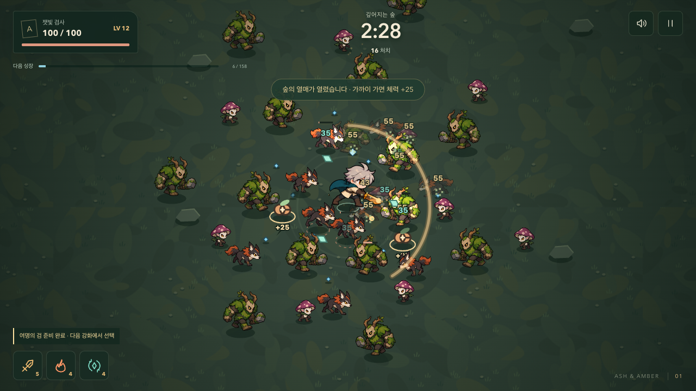
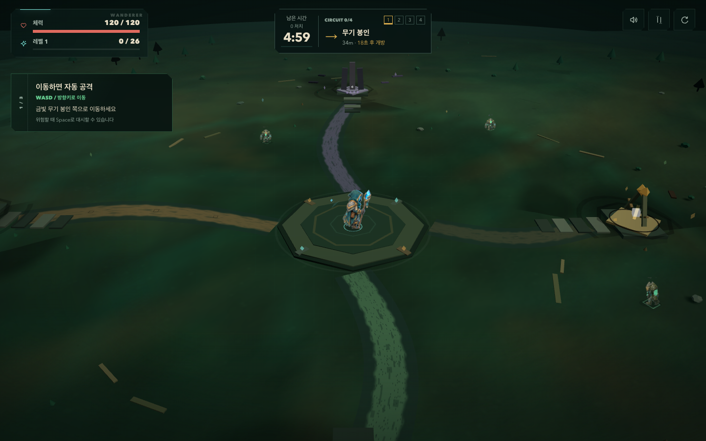
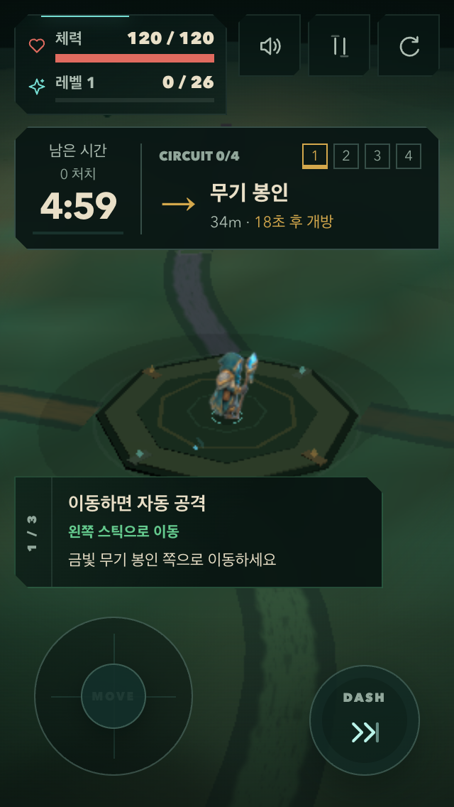

# Rune Drift Survivors

## Ash & Amber — 잿빛의 숲

A complete five-minute **2D cartoon survivor chapter** for the browser. Choose a companion, gather XP, evolve an automatic weapon and face the Ash Sovereign. The new game uses Canvas 2D; its entry does not load React or Three.js.

**[Play Ash & Amber](https://seung-won-yu.github.io/rune-drift-survivors/survivor/)** · [Play / development guide](./docs/survivor.md) · [Release verification](./docs/design/survivor-restart/09-RELEASE.md)



- **Three companions:** a swordsman, a fast ember caster and a defensive rune guardian, with distinct starting weapons and dedicated walk/attack/hurt/defeat art. Survive 60 seconds to unlock the caster; earn 200 total kills to unlock the guardian.
- **Six specialization paths:** choose a wide or focused sword, spreading fire or concentrated explosions, and close defense or a distant rune orbit. Each weapon keeps one path for the run, alongside its evolution.
- **Six relics, two optional objectives:** hold the altar for ten seconds or accept an eighteen-second chest curse to pick a run-long relic. Discoveries persist; combat bonuses reset on retry.
- **Three evolutions:** piercing Dawn Blade, Ash Comet (explosions or stronger specialized burning) and repelling Moonlit Ring. Pause to inspect recipes; ready evolutions appear at the next level-up.
- **A final encounter:** the sovereign arrives at four minutes with marked charges and thorn volleys. A boss kill wins; surviving five minutes without a kill is recorded separately.
- **Reasons to return:** companion unlocks, recent journeys, per-character records, discovered evolutions and a damage breakdown. Records are local to the current browser, with graceful storage failure handling.
- **Readable feedback:** three optional healing fruits, separate weapon sounds, enemy defeat reactions, keyboard/touch controls, pause, mute and reduced-motion support.

Run `npm ci` and `npm run dev`, then open **[the local game](http://127.0.0.1:5173/survivor/)**. Move with WASD/arrows or the touch stick. Attacks are automatic; use Escape/P to pause and 1–3 or a card to choose an upgrade.

Verification covers three full real-time browser runs, 57 core tests, 40 browser scenarios, capped-load checks and the Pages build path. Generated four-pose artwork, initial image download size and untested physical mobile hardware are documented in the [release record](./docs/design/survivor-restart/09-RELEASE.md). The [first expansion record](./docs/design/survivor-restart/10-EXPANSION.md) covers the new choices and their validation. The [design history](./docs/design/survivor-restart/00-RELEASE-PLAN.md) retains the earlier style experiments and implementation decisions.

## Existing Rune Drift prototype

A five-minute browser survival roguelite built with **React, Three.js, React Three Fiber, and Vite**. Guide a hooded Rune Warden through a ruined forest, build an automatic-attack loadout, and connect four seals before the final rift.

**[Play on GitHub Pages](https://seung-won-yu.github.io/rune-drift-survivors/)** · [Development guide](./docs/project-structure.md) · [QA guide](./docs/qa.md)



<details>
<summary>Mobile portrait gameplay</summary>



</details>

## How to play

1. Move with the keyboard or touch stick; your weapons attack automatically.
2. Collect XP and choose upgrades that strengthen your build.
3. Follow the arrow, distance, and opening time to the next seal. Stay in its activation area to connect it.
4. Read attack warnings, dash through pressure, and survive for five minutes.

Connecting all four seals completes the Rune Circuit and strengthens the final fight. The result screen distinguishes a completed circuit, survival with an incomplete circuit, and defeat.

## Features

| Area | What is playable |
| --- | --- |
| Weapons | Rune orb, storm brand, orbit blade, chain lightning, and solar nova |
| Builds | Storm + lightning, blade + nova, and orb + pierce synergy paths |
| Progression | XP drafts, sequential seal rewards, optional field pickups, and guided replay routes |
| Enemies | Runner, golem, brute, three elite roles, and the Rift Warden boss |
| Combat feedback | Contact windup, reach/countdown rings, charge warnings, hit reactions, and boss patterns |
| Controls | Keyboard, touch movement/dash, pause, sound settings, and persisted visual quality |
| Results | Damage contribution, DPS, damage taken, healing, circuit progress, and replay choices |

## Latest improvements

- **First-session flow:** movement, XP, and the first seal form one clear route. Early upgrade cards explain immediate effects and show concrete numeric changes; keyboard activation works alongside `1`–`3` shortcuts.
- **Build continuity:** armory rewards follow the active weapon build. A timed, optional reward after the first seal gives a short detour without blocking the next objective or duplicating its scheduled pickup.
- **HUD and upgrade design:** stable health/XP positions, four distinct seal states, readable direction/distance/opening time, explicit recommendations, larger rune illustrations, and clear selection actions.
- **Character and world readability:** an 18% larger player, color-preserving sprite treatment, smoother atlas minification, fewer body decorations, a stable player marker, quieter terrain, and action-focused effects.
- **Mobile layout:** 44px-or-larger HUD actions, compact landscape navigation, readable low-health feedback, and contextual guidance above the sticks on short portrait screens so the character stays visible.
- **Mobile results and controls:** circuit progress remains visible in a compact result row, and brighter touch labels keep MOVE readable above the joystick thumb.
- **Consistent combat:** rendering quality changes presentation budgets while preserving simulation limits, collision rules, and progression.

The [design records](./docs/design/gameplay-reframe/) document implementation decisions and verification. The screenshots above are captured from the local development build; GitHub Pages updates after the deployment workflow succeeds.

## Controls

| Action | Keyboard / pointer | Touch |
| --- | --- | --- |
| Move | `WASD` or arrow keys | Left stick |
| Dash | `Space` | Dash button |
| Choose an upgrade | Click, `1`–`3`, or `Tab` then `Enter` / `Space` | Tap a card |
| Pause / resume | `P`, `Esc`, or pause button | Pause / resume button |
| Restart | Restart button, then confirm | Restart button, then confirm |
| Sound | HUD sound button | HUD sound button |

## Run locally

Use **Node.js 22** (the version used by CI) and npm.

```bash
npm ci
npm run dev
```

Open the local URL printed by Vite, normally `http://localhost:5173`.

```bash
npm run build
npm run preview
```

The production build is written to `dist/`. No backend, account, or environment secrets are required.

## Test

```bash
# Full browser, gameplay, layout, and stress suite
npm run qa:smoke

# Three guided five-minute build routes with a fixed seed
npm run qa:balance
```

The smoke suite currently contains **86 cases**. It covers movement/dash, all 80 authored character animation cells, opening progression, seal rewards, optional detours, keyboard/dialog behavior, mobile layouts, damage feedback, results, and performance budgets. Viewport checks include 320×568, 360×740, 568×320, 740×360, tablet, and desktop layouts.

Local tests run headlessly with installed Google Chrome and enforce the real-time stress threshold. CI installs Playwright Chromium and uses software WebGL to check behavior and budgets without imposing the local FPS threshold. See [docs/qa.md](./docs/qa.md) for setup details and shorter balance runs.

Screenshots and measurements are written to `output/playwright/`; failure artifacts go to `test-results/`. These generated directories are ignored by Git. The two README screenshots are curated copies under `docs/images/`.

Physical-phone touch/audio latency, browser chrome, and low-end cold-load memory still need device testing. Browser QA does not establish those hardware results.

### Development scenes

Run `npm run dev` and append a scene query to the local URL:

| Query | Scene |
| --- | --- |
| `?qa=circuit&quality=balanced` | First-seal approach and navigation |
| `?qa=seal&quality=balanced` | Seal completion feedback |
| `?qa=starter-upgrade&quality=balanced` | Opening upgrade choices |
| `?qa=contact&quality=balanced` | Enemy contact windup, hit, and recovery |
| `?qa=threats&quality=balanced` | Elite/boss silhouettes and attack warnings |
| `?qa=stress&quality=balanced` | Dense combat and runtime budgets |
| `?qa=victory&quality=balanced` | Completed-run result |

These fixtures and `window.__RUNE_DRIFT_QA__` are development-only. Scene commands return a promise after React commits and the world is initialized; await the command or check `ready()` before inspecting it. Paused/result screens render on demand, while the stress fixture continuously renders for frame measurements. The [QA guide](./docs/qa.md) lists all scenes and controls.

## Visual quality

Use the pause menu to select **Auto, Performance, Balanced, or Quality**. The choice persists locally; Auto selects a presentation tier based on device and display conditions.

For a fixed mode, use `?quality=low`, `?quality=balanced`, or `?quality=high`. An explicit URL mode takes precedence over the menu. `?quality=high&fx=on`, `env=on`, and `?quality=cinematic` opt into more expensive presentation layers.

All modes use the same authored 2.5D character cast. Higher quality adds lighting, shadows, and effect detail. Enemy, projectile, and XP simulation limits remain identical.

## Project structure

```text
src/
  audio/      Web Audio cues
  config/     asset manifest, tuning, metadata, upgrades
  hooks/      React runtime lifecycle
  qa/         deterministic development scenes
  styles/     tokens, HUD, overlays, responsive layouts
  systems/    gameplay and frame-level runtime logic
  ui/         HUD, overlays, cards, touch controls
  world/      Three.js terrain, characters, effects, and atlas textures
public/
  sprites/    project-authored character atlases
  art/        project-authored upgrade icons
scripts/      Playwright smoke and balance checks
docs/         architecture, assets, QA, design records, and screenshots
```

Facade modules such as `gameState.js`, `runProgress.js`, and `weaponRuntime.js` keep their public imports stable while implementation lives in focused modules. See the [repository map and ownership boundaries](./docs/project-structure.md).

## Assets

Character and upgrade atlases are project-authored images. Terrain, foliage, landmarks, weapons, and effects use code-built geometry and textures; the runtime has no GLB or Blender dependency.

Character atlases use a shared cached RGBA conversion before mipmap filtering. Deterministic frame selection remains separate from rendering. See [asset sources and processing](./docs/assets.md) and [ASSET_CREDITS.md](./ASSET_CREDITS.md).

## Deployment

Pushes to `main` run [Deploy web game](./.github/workflows/deploy.yml): install dependencies, build, run the smoke suite, and deploy `dist/` to GitHub Pages. A failing build or smoke check prevents deployment.

Assets use `import.meta.env.BASE_URL` so the game works under the `/rune-drift-survivors/` Pages subpath. To reproduce that build locally:

```bash
GITHUB_PAGES=true npm run build
```

## Design and engineering notes

- [First-seal experience](./docs/design/gameplay-reframe/FIRST_SEAL_EXPERIENCE.md)
- [Build continuity and optional detour](./docs/design/gameplay-reframe/BUILD_AND_DETOUR_SLICE.md)
- [HUD and upgrade readability](./docs/design/gameplay-reframe/UI_READABILITY_PASS.md)
- [Character and world readability](./docs/design/gameplay-reframe/CHARACTER_AND_WORLD_PASS.md)
- [Material-first visual foundation](./docs/design/gameplay-reframe/VISUAL_FOUNDATION.md)
- [Balance: saturation and pursuit](./docs/design/gameplay-reframe/BALANCE_PASS_02.md)
- [Balance: opening pressure and hit feedback](./docs/design/gameplay-reframe/BALANCE_PASS_03.md)
