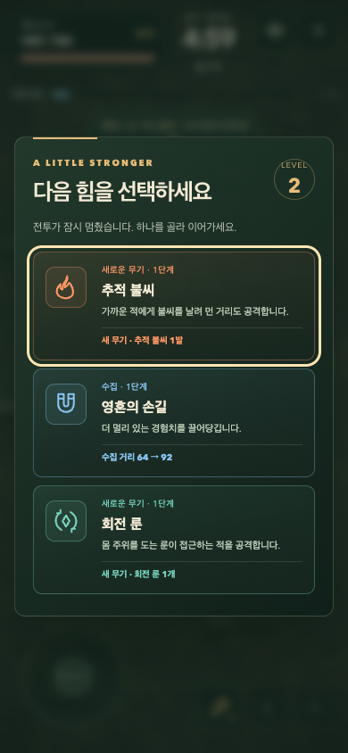

# 첫 플레이 버전 검증

2026-09-08 · 로컬 Chrome과 Codex 인앱 브라우저. 배포 전 검증 기록.

## 결과

새 게임은 `/survivor/`에서 실행된다. 시작 → 자동 전투 → 경험치 수집 → 강화 → 생존/사망 → 재도전 연결을 확인했다. 기존 게임은 `/`에서 유지된다.

| 검사 | 결과 |
| --- | --- |
| 순수 상태 테스트 | 11개 통과: 이동 정규화, 검 준비 동작, 경험치, 무적 시간, 강화 검증, 불씨 추적, 회전 룬, 연속 레벨업, 최대 강화, 승리/사망, 개체 상한 |
| 새 게임 브라우저 | 8개 통과: 시작, 키보드 이동/해제, 일시정지/복귀, 음소거, 탭 이탈, 처치/수집, 강화, 결과/재시작, 작은 화면, 실제 터치 취소, 동작 줄이기 |
| 기존 게임 회귀 | 핵심 6개 통과: 로딩, HUD, 키보드/대시, 모바일 조작/일시정지, 보스 HUD, 결과. 기존 전체 84개 재실행은 하지 않음 |
| 빌드 | 기본 빌드 및 `GITHUB_PAGES=true npm run build` 통과 |
| 배포 경로 | 로컬 preview의 `/rune-drift-survivors/survivor/`에서 이미지 요청·시작·일시정지 통과, 오류 없음 |
| 의존성 분리 | 새 페이지 요청에 React/Three.js 번들 없음. 배포 빌드에서 `?qa`를 붙여도 QA 전역 객체가 생성되지 않음 |

화면 크기: 1280×720 데스크톱, 320×640 및 390×844 세로, 740×360 가로. 모바일은 브라우저 에뮬레이션이며 실제 iOS/Android 기기 검증은 남아 있다.

## 발견 및 수정

- 많은 경험치를 한 번에 받아 연속 레벨업할 때 강화 화면이 이전 카드에 머무르는 문제: 매 선택 후 현재 카드와 레벨을 다시 렌더링.
- 추적 불씨가 발사 이후에는 직선으로만 움직이던 불일치: 살아 있는 목표의 위치를 따라 진행 방향 갱신.
- 320px에서 HUD 최소 너비가 화면을 초과할 수 있던 문제: 체력 영역을 유동 너비로 바꾸고 작은 화면 전용 간격 적용.
- 짧은 가로 화면에서 강화 패널이 길어지던 문제: 제목, 아이콘, 카드의 수직 간격 축소.
- 후반 강화 화면이 지나치게 자주 열리는 문제: 4레벨 이후 필요 경험치의 증가 폭 조정.

## 전투 속도 진단

`node scripts/survivor-balance.mjs`는 가까운 경험치를 찾아가고 적에게서 멀어지는 단순 봇이다. 체력 무적이나 피해 보정 없이 3개의 고정 시드를 실행했다. 무기는 불씨 → 룬 → 검 순으로 우선 선택한다. 사람의 난이도나 재미를 판정하는 실험은 아니다.

| 시드 | 첫 처치 | 첫 강화 | 종료 | 처치 | 종료 레벨 | 최대 동시 적 |
| --- | --- | --- | --- | --- | --- | --- |
| 12 | 8.30초 | 12.05초 | 300초 생존 | 1,485 | 23 | 111 |
| 42 | 9.07초 | 11.28초 | 300초 생존 | 1,492 | 23 | 96 |
| 99 | 8.48초 | 10.70초 | 300초 생존 | 1,495 | 23 | 82 |

조정 전 동일 봇은 46~49레벨에 도달했다. 조정 후 23레벨로 줄어 전투를 멈추는 선택 횟수를 줄였다. 세 시드 모두 종료 체력 180이어서 이 무기 우선순위의 후반 방어는 강하다. 후속 작업은 단순히 적 체력을 올리기보다 정예의 회피 가능한 패턴과 무기 선택 간 차이를 먼저 설계한다.

## 성능 관찰

1280×720, DPR 1, 로컬 headless Chrome에서 적 160마리를 유지하며 240프레임의 시뮬레이션 + Canvas 명령 제출 시간을 측정했다. 중앙값 약 0.5ms, 95백분위 약 1.9ms였다. 동기 루프 측정으로 GPU 표시 시간·실제 프레임 간격·발열을 포함하지 않으며 모바일 60FPS 보장은 아니다.

상한은 적 160, 경험치 240, 투사체 80, 효과 120이다. 적 분리 계산에 공간 버킷을 사용하고, 먼 적은 활성 범위로 재배치한다. 경험치 상한에서는 기존 보석에 값을 합쳐 보상을 보존한다. 그림자·타일은 코드로 생성하고 바닥 타일을 캐시한다. 렌더링 DPR은 최대 2다.

배포 JS는 새 게임 자체 약 26.75KB(gzip 11.24KB), CSS 약 16.59KB(gzip 4.73KB), PNG 두 개는 합계 약 2.6MB다. 최종 카툰 전용 시트를 만들 때 쓰지 않는 도트 비교 프레임을 제거할 수 있다.

## 구현 위치

- `src/survivor/game.js`: 순수 전투 상태, 성장, 적, 무기, 충돌. 브라우저 의존 없음.
- `src/survivor/render.js`: Canvas 전장, 스프라이트, 그림자, 피격과 무기 표현.
- `src/survivor/main.js`: 화면 전환, 고정 간격 루프, 키보드/터치/오디오, 개발 전용 QA 장면.
- `src/survivor/style.css`, `survivor/index.html`: HUD, 시작/강화/일시정지/결과.
- `public/art/survivor/README.md`: 생성 이미지 출처·프롬프트·알려진 애니메이션 제한.
- `scripts/survivor-unit.test.mjs`, `scripts/survivor-smoke.spec.mjs`: 회귀 검사.

## 다음 제작 순서

1. **캐릭터 타격 표현**: 카툰 전용 시트, 일정한 발 접지, 검 준비/타격/복귀의 리듬, 피격 및 사망 동작. 현재는 4포즈와 좌우 반전이다.
2. **첫 무기 진화**: 검의 강화 전후가 움직임과 타격 범위에서 뚜렷하게 달라지는 한 경로. 강화 설명과 실제 결과를 함께 제작.
3. **정예 행동**: 단순한 체력 증가에서 벗어나, 준비 표시를 보고 피할 수 있는 한 가지 패턴부터 검증.
4. **실기기 플레이 테스트**: 초반 첫 강화 도달, 위험 식별, 손가락 가림, 후반 밀도와 발열. 관찰 후 난이도/프레임 예산 조정.

이번 단계는 기본 전투와 시각 방향을 실제로 확인하는 첫 플레이 버전이다. 보스 고유 패턴, 영구 성장, 상점, 다수 캐릭터, 완성된 콘텐츠 분량은 포함하지 않는다.

