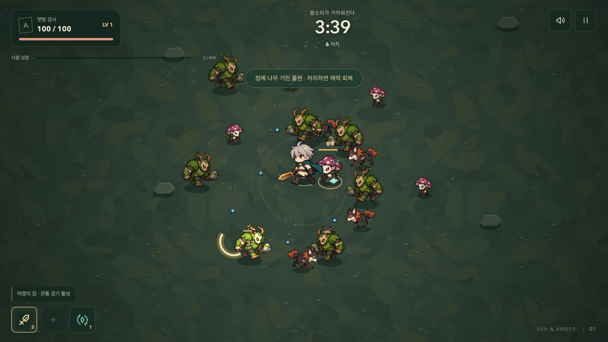
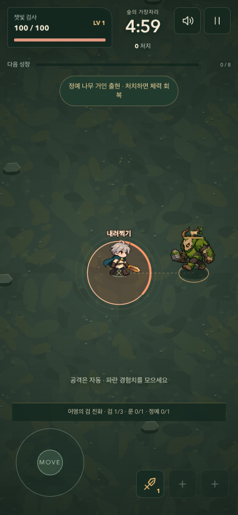

# 검의 성장과 정예의 첫 패턴

2026-09-08 · 첫 플레이 버전 다음 단계. 실행 주소 `/survivor/`.

## 이번 변화

이동과 수집에 더해, 진화를 목표로 강화하고 위험 표시를 보고 피하는 두 가지 판단을 추가했다.

### 황동 검 → 여명의 검

- 조건: 황동 검 3단계 이상, 회전 룬 1단계 이상, 정예 1마리 이상 처치.
- 조건을 충족하면 다음 레벨업의 첫 카드에 진화를 보장한다. 선택을 미루면 이후에도 제시한다.
- 진화 효과: 검 피해 +20, 범위 +38, 공격 각도 약 147도 → 220도, 매 검격마다 관통 검기 발사.
- 검기: 검 피해의 65%를 반올림한 피해, 초속 330, 0.85초 지속, 최대 8마리 관통. 같은 검기가 같은 적에게 중복 피해를 주지 않는다. 검격과 검기는 별도 타격이다.
- 하단에 조건 진행 상황을 표시한다. 진화 후 무기 슬롯과 결과 화면에 여명의 검 이름을 표시하며 재시작하면 초기화한다.

### 검 공격 동작

기존 4포즈 시트를 유지하고 코드로 몸의 당김, 압축, 타격 방향의 짧은 전진, 복귀를 추가했다. 준비 시간 0.18초와 실제 타격 시점을 공유한다. 준비 궤적은 약하게, 타격 궤적은 밝게 표시하며 진화 검의 넓은 각도를 함께 반영한다.

새로운 다방향 원화나 관절 애니메이션 제작은 이번 변경에 포함하지 않는다. 추가 몸 변형은 동작 줄이기 설정에서 비활성화한다.

### 정예 나무 거인: 내려찍기

- 가까이 접근하면 플레이어의 현재 위치를 고정된 목표로 지정한다.
- 반경 76의 원과 채워지는 테두리, ‘내려찍기’ 표식을 0.95초 동안 표시한다. 이후 목표를 추적하지 않는다.
- 충돌은 표시 반경과 플레이어 반경 12를 사용한다. 원 밖으로 몸 전체가 벗어나야 피한다.
- 타격 피해 24, 회복 동작 0.65초, 다음 준비까지 재사용 대기 3.8초.
- 준비/타격/회복 중 정예는 멈추고 접촉 피해를 주지 않는다. 준비 중 처치하면 공격이 취소된다.
- 일시정지와 강화 선택 중 준비 시간이 멈춘다. 기존 피격 무적 시간을 공유해 여러 공격이 같은 순간 체력을 중복해서 깎지 않는다.

## 검증

- `npm run qa:survivor`: 상태 테스트 **15개**, 실제 브라우저 테스트 **11개** 통과.
- 진화 조건/카드 보장, 관통 중복 방지, 정예 타격 전후 피해, 회피, 공격 중지, 재시작 초기화를 검증했다.
- 데스크톱 1280×720, 모바일 390×844에서 0.25초 반응 후 이동으로 회피 성공, 제자리에 있을 때 24 피해를 확인했다. 모바일은 브라우저 에뮬레이션이다.
- 기존 작은 화면/터치 취소/연속 강화 검사도 통과. `npm run build` 통과.
- 캡처 이미지는 `images/evolved-combat.png`, `images/elite-warning-mobile.png`에 보관한다.

고정 시드 봇의 전체 5분 진단:

| 시드 | 첫 진화 | 종료 레벨 | 처치 | 정예 처치 | 결과 |
| --- | --- | --- | --- | --- | --- |
| 12 | 126.50초 | 22 | 1,469 | 4 | 생존 |
| 42 | 101.35초 | 22 | 1,461 | 4 | 생존 |
| 99 | 174.17초 | 22 | 1,490 | 4 | 생존 |

진단 봇은 조건을 충족하면 진화를 우선 선택한다. 이는 일반 성장 경로에서 진화가 도달 가능하다는 확인이며 인간의 재미/난이도 평가는 아니다. 세 시드 모두 체력 180으로 끝나므로 후반 생존 여유가 큰 상태다. 다음 밸런스 판단에는 실플레이에서의 정예 회피율과 빌드 선택 차이가 필요하다.

