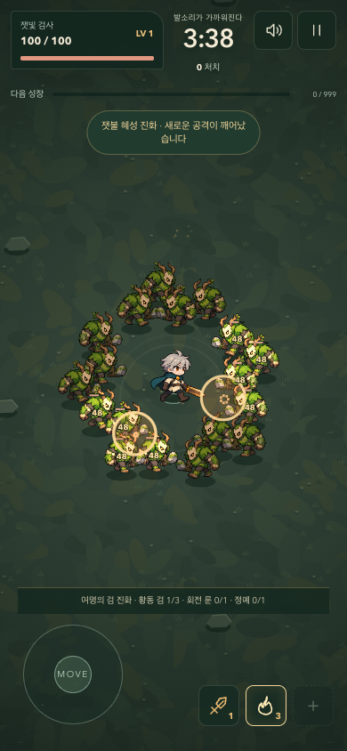
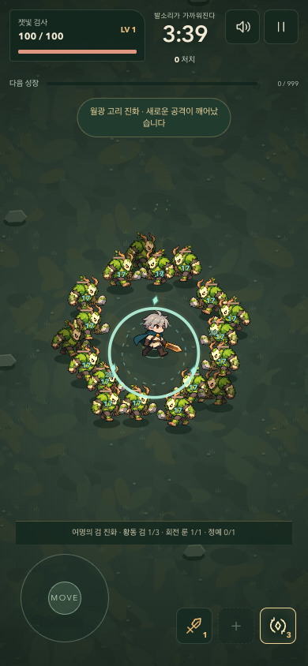

# 세 무기의 성장 경로

2026-09-08 · 보스 구현 이후 진행. 전체 개발 목표는 아직 진행 중이다.

## 선택의 차이

| 진화 | 조건 | 전투 변화 |
| --- | --- | --- |
| 여명의 검 | 황동 검 3, 회전 룬 1, 정예 1 처치 | 피해 +20, 범위 +38, 넓은 검격과 관통 검기 |
| 잿불 혜성 | 추적 불씨 3, 가벼운 발걸음 1, 정예 1 처치 | 불씨 피해 +12, 적중 지점 반경 56 폭발. 각 적에게 한 번씩 피해 |
| 월광 고리 | 회전 룬 3, 숲의 심장 1, 정예 1 처치 | 룬 +1, 회전 반경 +12, 2.8초마다 반경 130의 피해/밀어내기 파동 |

기본 룬 타격에도 짧은 밀어내기를 추가해 접근을 늦춘다. 파동은 룬 피해의 60%를 반올림한 피해를 주며, 일반 적에게 기본 타격보다 강한 밀어내기를 준다. 보스의 이동/패턴은 밀어내기에 흔들리지 않는다.

불씨 폭발은 원래 직접 타격과 중복 계산하지 않는다. 검격과 검기는 별도 공격이며, 같은 검기가 같은 적에게 반복 타격하지 않는다. 진화는 한 번만 선택 가능하다. 진화 뒤에도 해당 무기의 기본 단계를 강화할 수 있다.

## 선택 화면과 안내

- 첫 강화에서 불씨/룬을 모두 제시한다. 룬을 시작하려고 먼저 불씨를 선택할 필요가 없다.
- 모든 진화 조건을 충족했다면 최대 3개 진화가 함께 제시된다. 이미 선택한 진화는 다시 제시하지 않는다.
- 하단 안내는 현재 성장 정도에 가까운 다음 진화의 진행 상황을 표시한다.
- 일시정지의 ‘무기 진화 조건 보기’에서 세 조합을 확인할 수 있다. 키보드 포커스 순서에 펼침 요소도 포함했다.
- 무기 슬롯·강화 카드·결과 화면은 실제 진화 이름을 표시한다. 새 판에서는 전투 내 진화 상태가 초기화된다.

## 검증

- 상태 테스트 25개 통과: 기존 전투/보스와 각 진화의 조건, 폭발 범위/중복, 파동 범위/밀어내기, 첫 선택 보장 포함.
- 브라우저 테스트 16개 통과: 세 진화의 실제 효과, 모바일 표시, 조건 안내, 승패, 재시작, 보스, 터치/키보드 포함.
- `npm run build` 통과.

## 빌드별 진단과 한계

`node scripts/survivor-balance.mjs`는 검·불씨·룬 우선순위 각각에 시드 12/42/99를 실행한다. 룬 경로는 공격 범위에 들어가도록 더 가까운 거리를 유지한다. 표시된 내려찍기와 돌진에는 0.2초 후 반응한다. 가시 탄막을 읽는 별도 회피 로직은 없다. 체력/피해/시간을 수정하지 않는다.

최종 기록: [balance-2026-09-08.jsonl](./balance-2026-09-08.jsonl).

| 경로 | 시드 12 | 시드 42 | 시드 99 |
| --- | --- | --- | --- |
| 검 | 291초 승리 | 300초 생존 | 271초 승리 |
| 불씨 | 271초 승리 | 281초 승리 | 299초 승리 |
| 룬 | 293초 패배 | 300초 생존 | 296초 승리 |

초기 봇은 예고를 무시했고 룬 경로에서 88~146초에 사망했다. 피해 원인 기록으로 정예 내려찍기의 반복 피격이 큰 비중임을 확인했다. 같은 피해 규칙에서 예고를 보고 회피하게 하자 최종 구간까지 도달했다. 이 변경은 게임 난이도를 낮춘 것이 아니라 근접 빌드 진단에 필요한 이동 정책을 보완한 것이다. 초기 선택의 무기 보장과 기본 룬의 밀어내기는 별도의 실제 게임 개선이다.

이 결과로 세 경로의 도달 가능성과 피해 역할은 확인했지만 인간 승률이나 동등한 난이도를 입증한 것은 아니다. 특히 룬은 접촉/탄막 피해의 부담이 크다. 캐릭터 시작 특성을 연결한 뒤 근접 생존 여유와 보스 접근 방법을 다시 검토한다. 결과 화면에 사용할 수 있도록 접촉·내려찍기·돌진·탄막별 실제 받은 피해를 상태에 기록했다.

