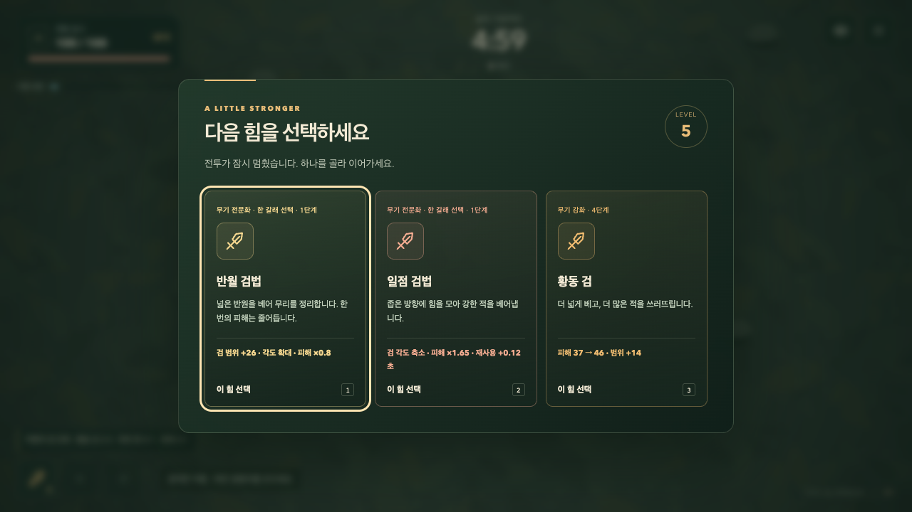
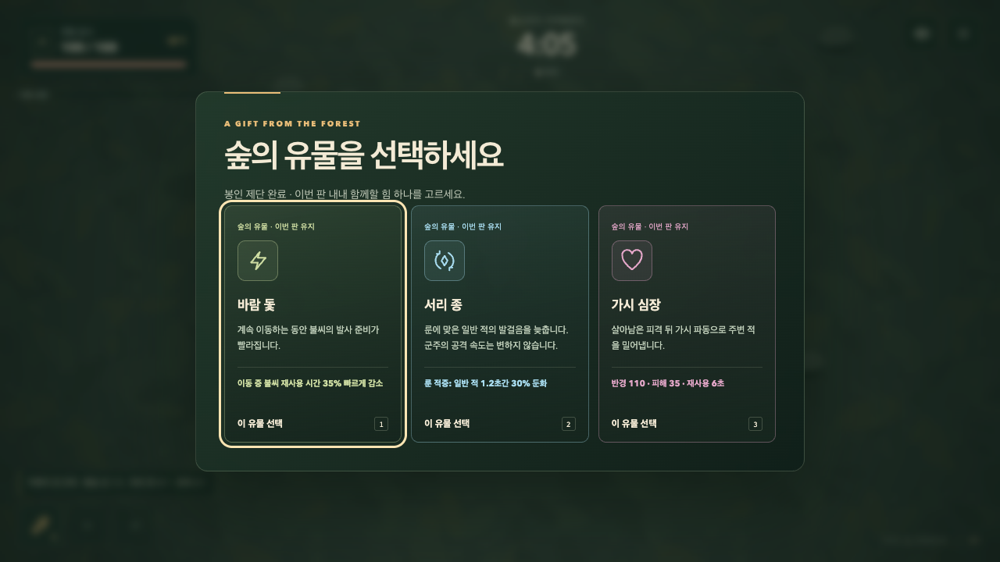

# 숲의 선택 — 첫 확장 제작 기준

2026-09-09. 사용자 승인 범위: 기존 무기 3종의 빌드 분기, 유물 6개, 전장 이벤트 2종. 같은 5분 숲에서 다른 선택과 전투 양상이 생기는지 확인한다. 새 지역과 캐릭터 추가는 후속이다.

## 구현 계약

- 레벨 4 이후 무기 3단계부터 무기당 2개 전문화 후보를 제시한다. 한 무기에서 한 갈래만 선택하며 기존 진화와 함께 작동한다. 검은 광역/집중, 불씨는 연소/폭발, 룬은 근거리 방어/원거리 공격으로 나눈다. 수치·손익·현재 선택을 카드, 일시정지, 결과에서 표시한다.
- 유물 6종은 전장 보상에서 중복 없이 선택한다. 불씨 점화, 검의 정예 특화, 룬의 둔화, 불씨의 이동 중 연사, 경험치 회복, 피격 반격으로 구분한다. 무한 연쇄·반복 지급·개체 상한 우회는 금지한다.
- 봉인 제단은 45초에 등장한다. 접근하면 주변 85 범위에서 누적 10초 버티기를 시작하고 벗어나면 진행이 멈춘다. 경고를 본 뒤 참여할 수 있어야 한다.
- 저주 상자는 135초에 등장한다. 접근한 뒤 명시적으로 수락하면 18초 동안 일반 적의 이동 속도/접촉 피해가 25% 증가한다. 거절 가능하며 시간이 끝나면 유물 선택을 제공한다. 보스는 강화하지 않는다.
- 이벤트는 각각 한 번, 보상은 유물 3개 중 하나. 참여하지 않아도 기존 승패는 가능하다. 남은 시간·방향·위험·보상을 표시하고 모바일에서도 전투 HUD와 충돌하지 않는다.
- 분기/유물 발견과 최근 판 선택을 기존 로컬 프로필에 호환되게 저장한다. 새로 시작한 판에는 전투 효과를 이월하지 않는다.

## 완료 증거

각 분기의 실제 공격 차이, 6개 유물 발동/경계, 제단 이탈·재진입, 저주 수락·거절·시간 정지·지급 1회, 선택/결과/저장/재도전, 키보드·터치 화면, 정상 전체 플레이 및 최대 부하를 확인한다. 코어/브라우저/production 검사와 README/출시 기록을 갱신한다. main 전달/배포 후 공개 실행을 확인한다.

## 구현과 로컬 검증

- `expansion.js`: 여섯 전문화/유물의 식별자와 카드 설명. `game.js`: 실제 공격·연소·둔화·피격/회복과 전문화 선택의 상호 배제. `encounters.js`: 제단/상자 상태 전이와 보상 1회 지급.
- 이벤트·보상 선택에서는 전투 시간이 멈춘다. 기존 프로필 버전에 새 발견 목록/최근 판 선택을 안전하게 추가하며 이전 저장을 읽는다. 재도전은 유물·이벤트·전문화를 초기화한다.
- Canvas 제단/상자, 범위와 진행 원, 방향 안내, 연소/둔화 표식, 전문화별 공격 범위·색·음향을 구현했다. 추가 이미지 다운로드는 없다.
- 코어 57개 통과. 기존 32개와 새 8개를 합한 브라우저 40개 통과. 이후 음향/진화 문구 변경 관련 7개 재검사 통과. 320/390 세로·740 가로 화면에서 선택 카드와 이벤트 안내를 직접 확인했다.

## 정상 규칙의 18판 진단

`node scripts/survivor-expansion-balance.mjs`로 여섯 경로를 시드 12/42/99에서 각각 실행했다. 시간은 고정 스텝으로 빠르게 계산하지만 체력·피해·생성 규칙은 바꾸지 않는다. 자동 입력이 경험치/사건 방향으로 이동하고, 보이는 공격 예고를 피하며 제공된 선택과 상자 수락만 수행한다. 원본은 [확장 경로 기록](./expansion-balance-2026-09-09.jsonl)에 있다.

| 주력 경로 | 3판 결과 | 관찰 |
| --- | --- | --- |
| 반월 검법 | 생존 3 | 넓은 무리 처리와 높은 남은 체력, 군주 격파는 남음 |
| 일점 검법 | 격파 3 | 좁은 공격을 맞추면 군주 처리에 유리 |
| 번지는 불꽃 | 격파 3 | 군중 사이 전파와 유물 점화 시너지 |
| 응축 화염 | 격파 3 | 느린 발사와 넓은 폭발의 교환 |
| 수호 결계 | 생존 3 | 근접 방어로 버티지만 군주 격파는 남음 |
| 별자리 궤도 | 격파 3 | 떨어진 위치에서 룬을 맞추는 경로 |

모든 판에서 제단/상자를 완료하고 유물 2개를 얻었다. 초안에서는 연소가 이미 불붙은 적에게 옮겨가 낭비됐다. 불붙지 않은 가까운 두 적으로 바꾼 뒤 연소 경로의 적 밀집 최고치는 160에서 시드별 64~70으로 낮아졌다. 이 결과는 자동 입력의 진단이며 사람의 난이도/재미 평가나 모든 선택 조합의 균형을 보장하지 않는다. 원거리/집중 경로와 방어 경로의 보스 처리 차이는 후속 플레이 평가 대상으로 남긴다.

## 전달 게이트

실제 시간 3판의 전투·유물/이벤트·결과 저장·재도전이 통과했다. 검사 프로그램의 브라우저 종료 응답이 지연됐지만 상태를 조사하는 동안 정상 완료됐으며 exit code는 0이다. 전투 규칙을 바꾸거나 검사 조건을 생략하지 않았다. [전체 플레이 기록](./expansion-fullrun-2026-09-09.json).

| 동료 | 게임 시간 / 결과 | 처치 | 전문화 | 유물 |
| --- | --- | --- | --- | --- |
| 검사 | 300초 / 생존 | 955 | 반월 검법·별자리 궤도 | 송곳니·이슬 씨앗 |
| 불씨술사 | 290.05초 / 격파 | 957 | 번지는 불꽃 | 바람 돛·가시 심장 |
| 수호자 | 300초 / 생존 | 959 | 수호 결계 | 가시 심장·서리 종 |

세 화면 모두 프레임 p95는 약 16.7ms였다. 실제 시간 전체 플레이 중 50ms 초과 프레임은 검사 5개, 불씨술사 1개, 수호자 0개로 기록했다. 오류는 없었다. 시뮬레이션과 실제 입력에서는 카드가 표시되는 프레임 간격에 따라 선택 후보/RNG 흐름이 달라질 수 있으므로 결과를 같은 실행으로 취급하지 않는다.

GPU 가속을 끈 확장 부하(연소·둔화·넓은 궤도 포함)도 1280/390/740 세 화면 모두 통과했다. [CPU 기록](./expansion-cpu-2026-09-09.json). 원격 전체 검사와 공개 배포 확인은 다음 전달 단계다. 기존 물리 모바일/iOS Safari 검증 한계는 유지한다.

## 렌더링 보완

원격 부하 보완: 실행 `34296017281`에서 코어 57개와 브라우저 39개가 통과했고 1280px 확장 부하만 p95 50ms로 기준(<50ms)을 넘었다. 연소로 다수 적이 동시에 피격되는 상황에서 큰 아틀라스를 반복 축소하는 비용을 줄였다. 적 3종의 일반/정예 크기, 4포즈, 일반/피격 프레임 48개를 월드 크기의 3배 해상도로 미리 준비한다. 화면 최대 배율 2.4배보다 높으며 개체 수, 공격, 연소/둔화, 효과와 QA 기준은 유지한다.

추가 RGBA 버퍼는 약 14.26MiB로 고정된다. 캐시 전후 같은 장면을 직접 비교했으며 리샘플링에 따른 경계 픽셀 차이는 있다. GPU 비활성·4배 CPU 제한 진단에서 같은 12초의 프레임 수가 169에서 233으로 증가하고 p95가 약 100ms에서 66.7ms로 감소했다. 이는 일부러 더 느리게 만든 비교 조건이며 배포 통과 결과와 구분한다. [렌더링 비교 기록](./expansion-render-2026-09-09.json).

적 프레임 캐시 적용 후 코어 57개·브라우저 40개 전체 검사, GPU 비활성 3개 화면, Pages 빌드/production 검사가 모두 통과했다. 전체 플레이 이후 전투 규칙은 변경하지 않았다.
