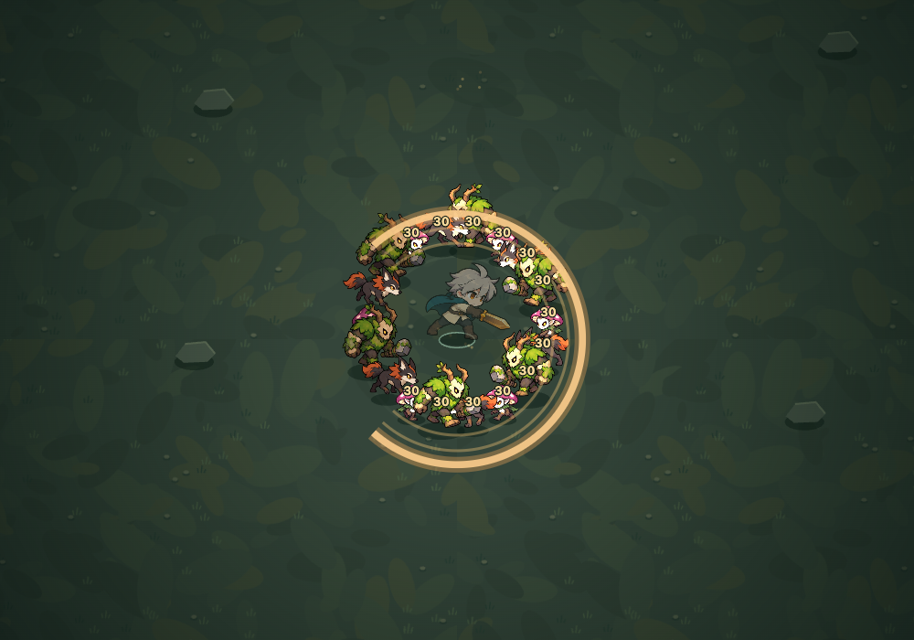
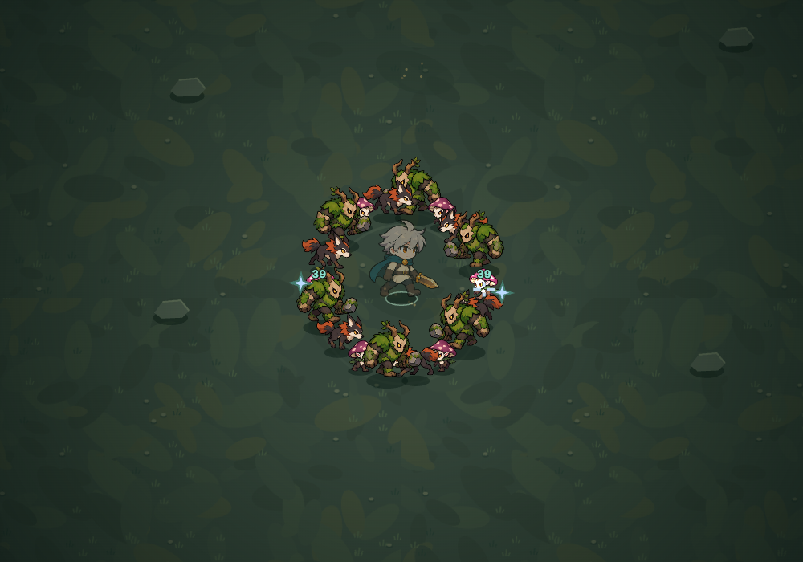
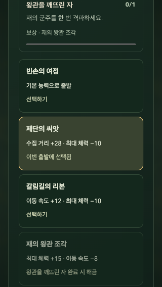

# 손맛과 다음 여정

2026-09-09. 첫 확장 다음 단계는 기존 전문화의 전투 표현과 다음 판의 도전·해금 흐름이다. 새 지역·캐릭터·유물 종류는 추가하지 않는다.

## 제작 기준

- 여섯 전문화의 모양과 실제 적중 반응을 구분한다. 공격 판정·피해·시간을 연출 때문에 바꾸지 않는다.
- 일점 검은 집중된 직선 검격과 적중 표시/타격음, 반월 검은 겹친 넓은 잔상으로 표현한다.
- 연소 전파는 실제로 불이 옮겨간 적 사이에 짧은 연결을 표시하고, 응축 화염은 폭발 중심과 충격 원/저음을 강조한다.
- 수호 룬은 방패, 별자리 룬은 별 모양이며 적중 시 방어 호/별빛 반응을 사용한다.
- 효과는 기존 120개 상한과 게임 시간의 수명을 공유한다. 새 적중/전파 표시는 종류별 60~90ms 간격을 두며 일시정지하면 멈춘다. 화면 전체 흔들림이나 새 이미지 요청은 없다.

## 숲의 도전과 기념품

| 도전 | 완료 조건 | 해금 보상 | 출발 효과 |
| --- | --- | --- | --- |
| 숲의 응답 | 제단을 완료한 여정 1회 종료, 쓰러져도 인정 | 제단의 씨앗 | 수집 거리 +28, 최대 체력 −10 |
| 두 갈래의 기록 | 서로 다른 전문화 2개를 여정 기록에 남기기 | 갈림길의 리본 | 이동 속도 +12, 최대 체력 −10 |
| 왕관을 깨뜨린 자 | 군주 1회 격파 | 재의 왕관 조각 | 최대 체력 +15, 이동 속도 −8 |

기념품은 동료 선택의 ‘숲의 도전’에서 하나만 선택한다. ‘빈손의 여정’은 기존 기본 능력을 그대로 사용하며 기존 무기·유물을 제한하지 않는다. 선택은 저장되고 같은 설정으로 재도전하지만 체력·보너스는 새 판에 한 번만 적용한다. 전투 중에는 바꿀 수 없다. 일시정지/결과에 기념품의 효과와 대가를 표시한다.

도전 목록에는 조건·보상·진행도를, 결과에는 이번에 새로 완료한 도전과 장착 위치를 표시한다. 실패 시 회피 팁과 다음 목표를 함께 제공한다. 첫 출발 버튼은 도전 목록보다 먼저 둔다.

기존 version 1 기록은 유지한다. 저장된 전문화 발견과 군주 승리는 소급 인정한다. 이전 기록에는 제단 완료 여부가 없으므로 임의로 추정하지 않는다. 새 `altarRuns`와 `keepsake`를 정규화하고, 잠긴/알 수 없는 기념품은 빈손으로 되돌린다. 기존의 종료/고유 run ID 검증으로 보상 중복을 막으며, 저장 실패 시 현재 세션에서는 선택과 해금을 유지한다.

## 확인할 결과

- 도전 달성 → 결과의 새 보상 → 캠프에서 선택 → 새로고침 → 실제 능력 반영 → 재도전 초기화.
- 기존 저장·저장 거부·잠긴 선택·기본 출발의 호환성.
- 여섯 전문화의 실제 공격에 연결된 효과 생성, 정지/만료/상한과 화면 구분.
- 작은 세로 화면과 낮은 가로 화면의 도전 목록, 선택과 시작 접근.
- 코어·브라우저 회귀, 최대 부하와 Pages 빌드/공개 실행.

코어 62개와 브라우저 44개가 통과했다. 기념품 선택 시 스크롤을 유지하도록 보완한 뒤 관련 4개 브라우저 흐름을 다시 통과했다. 전체 브라우저 실행에서 1280/390/740px 최대 부하의 p95는 모두 약 16.7ms였고, 각 12초 중 50ms 초과는 0개였다. 여섯 전문화의 실제 효과를 렌더링해 모양도 확인했다. 독립 리뷰에서 추가 수정 사항은 없었다. 음향은 발생 경로와 기존 제스처·뮤트·중단 흐름을 확인했으며 사람의 청감 평가는 별도다.

동료 3명 × 빈손/기념품 4설정, 시드 42의 정상 규칙 진단 12판이 모두 종료됐다. 11판은 생존 또는 군주 격파, 왕관을 고른 불씨술사는 248.8초에 쓰러졌다. 같은 자동 입력에서도 수집/이동/체력의 교환이 다른 전투와 성장 결과를 만들며, 이를 사람의 승률이나 특정 기념품의 우열로 해석하지 않는다. [12판 기록](./journey-balance-2026-09-09.jsonl).

원격 검사와 공개 전달은 최종 배포 단계에서 확인한다. 자동 검사는 사람의 타격감 선호나 물리 휴대전화의 발열·성능을 대신하지 않는다.
