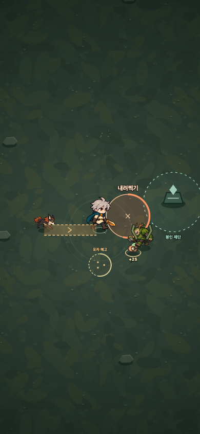

# 숲의 적 — 이동과 우선순위

2026-09-10. 기존 버섯 정령·숲 사냥개·나무 거인에 서로 다른 대응을 요구하는 행동을 추가한다. 기존 캐릭터·빌드·유물·기념품·5분 구조는 유지한다.

## 동작 계약

- 버섯: 죽은 자리에 반경 32의 포자 구역을 남긴다. 0.7초 예고 후 1.6초 활성화하며 피해는 6이다. 초반 조작 안내가 끝난 18초 이후부터 사용한다. 생성 간격 0.6초·중심 간격 70 이상·동시 최대 4개이며 예고 중에는 피해가 없다. 공통 피격 무적 0.85초가 중첩 피해를 제한한다.
- 사냥개: 몸을 낮추고 고정된 돌진 통로를 보여준 뒤, 예고한 방향으로 이동한다. 돌진 중 실제 이동 구간의 충돌을 검사하고 한 번만 타격한다. 돌진 후 빈틈이 생기며 서리 종의 둔화는 이동 시간을 늦춘다.
- 일반 거인: 팔을 들고 플레이어 위치에 공격 지점을 고정한다. 1.15초 후 반경 62 안에 18 피해를 주며 0.85초 회복한다. 정예는 기존 반경 76·0.95초·24 피해를 유지한다.
- 일반 적의 동시 예고/공격은 전체 기존 공격을 세어 최대 3개 이하일 때만 시작한다. 사냥개는 최대 2마리, 일반 거인은 최대 1마리다. 정예/보스의 기존 공격은 보존한다.
- 포자와 돌진 경계는 플레이어 공격 효과 위에 그린다. 원/통로/점선/채워지는 예고로 구분하고 첫 행동에만 짧은 안내를 보여준다. 움직임 감소 설정에서도 의미가 유지된다.
- 일시정지·성장 선택에서 타이머가 멈추고 새 판에 초기화한다. 죽은 적은 예고를 끝내며 멀리 재배치된 적의 이전 예고도 취소한다. 사망은 보상보다 우선한다.

## 시간대별 구성

| 구간 | 버섯 / 사냥개 / 일반 거인 | 의도 |
| --- | --- | --- |
| 0–30초 | 100 / 0 / 0% | 이동·경험치와 포자 소개 |
| 30–90초 | 70 / 30 / 0% | 직선 돌진 회피 |
| 90–150초 | 65 / 25 / 10% | 느린 범위 공격 도입 |
| 150–210초 | 50 / 35 / 15% | 이동 경로의 압박 |
| 210–240초 | 50 / 25 / 25% | 무리 처리와 큰 적의 우선순위 |
| 군주전 | 70 / 25 / 5% | 군주 예고를 읽을 여유 |

생성 간격·전체 적 160개 상한·정예 주기는 바꾸지 않는다. 자동 입력 진단은 실제 보이는 원/통로에 200ms 후 반응하며 능력치·적 체력·시간을 바꾸지 않는다.

## 검증

최초 정상 규칙 진단에서 근접 수호 빌드에 포자 피해가 139~168 누적됐다. 처치 보상이 과도한 바닥 위험으로 이어지지 않도록 동시 개수 6→4, 활성 시간 2.4→1.6초, 생성 간격 0.35→0.6초로 조정했다. [초기 진단](./enemies-balance-initial-2026-09-10.jsonl).

진단용 자동 입력도 포자를 피할 때 기존 무리 회피 방향을 덮어쓰던 동작을 고쳤다. 포자와 가까울수록 회피 방향을 더하는 방식이며 게임의 체력·피해·시간에는 관여하지 않는다. 최종 6개 전문화 경로 × 시드 12/42/99의 18판은 군주 격파 11판, 5분 생존 4판, 사망 3판이었다. 번지는 불꽃 경로는 192초/260초, 수호 결계는 278초에 실패한 사례가 남아 있다. 모든 판에서 제단·상자와 유물 2개를 완료했다. [최종 진단](./enemies-balance-2026-09-10.jsonl). 입력 로직도 변경됐으므로 초기 결과와 단순 승률 비교를 하지 않으며, 자동 입력 결과를 사람의 승률로 해석하지 않는다.

독립 코드 리뷰에서 일반 거인의 사망 안내가 ‘정예’로 표시되던 문구를 ‘내려찍기’로 고쳤다. 처치 중 예고 취소, 멀리 재배치 시 이전 공격 취소, 둔화 중 돌진, 일시정지·재시작·사망 우선순위를 코어 검사에 포함한다.

최종 로컬 코어 70개·브라우저 50개와 Pages 하위 경로 production 검사가 통과했다. 1280×720, 390×844, 740×360에서 적 160마리의 12초 부하 검사 p95는 16.7/16.8/16.7ms, 50ms 초과 프레임은 0개였다. 개발용 QA 전역은 배포 빌드에서 제거되며 이미지 5개 로딩과 출발·일시정지도 통과했다. 인앱 브라우저에서 출발 HUD의 국면 이름과 실제 정지 화면을 확인했다.

[로컬 검사 기록](./enemies-local-qa-2026-09-10.json). 실제 시간 브라우저 3판에서는 검사가 291.18초에 군주를 격파하고, 수호자는 300초 생존했으며, 불씨술사는 260.22초에 쓰러졌다. 세 판 모두 제단·상자를 완료해 유물 2개를 얻었고, 종료 기록 1회 저장과 재도전 시 초기화를 통과했다. 각 화면의 p95는 16.7~16.8ms, 50ms 초과는 0개, 페이지 예외는 없었다. [전체 플레이 기록](./enemies-fullrun-2026-09-10.json).

다음 사람 플레이테스트에서는 첫 포자 피해의 원인을 알아차리는지, 사냥개를 옆으로 피할 수 있는지, 연소·근접 수호 빌드가 새 위험을 지나치게 자주 떠안는지 확인한다. 후반 사망 사례가 남아 있으므로 이번 자동 검사 통과를 난이도 균형의 완성으로 취급하지 않는다.

이미지는 움직임 감소 설정의 실제 게임 캔버스이며 HUD를 제외한 공격 가독성 기록이다. 새 이미지를 다운로드하지 않고 기존 아트의 자세와 Canvas 도형을 사용한다. 화면 검사는 실제 휴대전화의 발열·터치 반응을 대신하지 않는다.

## 공개 반영

실행 커밋 `9e58347bc92e87b5f251ff749d2e7452935de974`의 [원격 실행](https://github.com/Seung-Won-Yu/rune-drift-survivors/actions/runs/34420209767)이 코어 70개·새 게임 브라우저 50개·기존 게임 86개, 합계 206개와 production 검사·Pages 배포를 모두 통과했다. 원격 부하 검사 p95는 1280/390/740px 순서로 33.4/16.7/16.7ms였고 50ms 초과는 없었다. [CI 기록](./enemies-release-ci-2026-09-10.json).

2026-09-10 09:29 KST에 공개 JavaScript/CSS/프리로드 및 이미지 5개의 해시가 로컬 Pages 빌드와 일치함을 확인했다. 출발 국면 이름, 시작·이동·정지·재개, 기념품 선택지, 모바일 조이스틱 배치와 화면 넘침 부재를 확인했고 HTTP 오류·페이지 예외·개발용 QA 전역은 없었다. [공개 확인 기록](./enemies-public-release-2026-09-10.json). 인앱의 공개 탭도 새 버전으로 갱신했다.

마지막 기록 커밋은 문서와 검사 결과만 포함해 `[skip ci]`로 남긴다. 공개 실행 코드는 위 원격 검사를 통과한 커밋과 동일하다.
