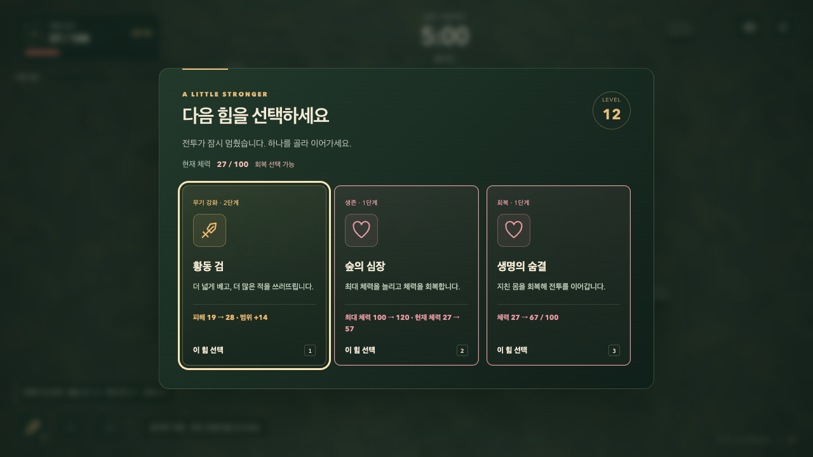

# 성장과 회복의 선택

2026-09-10. 적 역할 확장 후 연소·근접 수호 빌드의 후반 실패 기록을 조사했다. 이번 범위는 실패 진단의 선택 편향과 성장 화면에서의 회복 판단이다.

## 확인한 원인

자동 입력은 정해진 강화 우선순위만 사용했다. 연소 경로 시드 12는 체력 27/85, 27/85, 24/85에서 ‘숲의 심장’을 제시받고도 수집 강화를 골랐다. 수호 경로 시드 99는 44/205에서 회복을 제시받고도 새 검을 골랐다. 이 결과만으로 특정 무기의 피해량을 높일 근거는 부족하다.

동일 시드·이동 로직·전투 규칙에서 체력 40% 이하일 때 실제 제시된 ‘숲의 심장’, 없으면 ‘생명의 숨결’을 우선 선택하도록 진단 도구를 고쳤다. 없는 카드를 생성하거나 선택 외의 체력·능력치·시간을 직접 수정하지 않는다. [선택 전후 기록](./recovery-choice-diagnostic-2026-09-10.json).

| 경로 / 시드 | 기존 선택 | 체력을 고려한 선택 |
| --- | --- | --- |
| 연소 / 12 | 192초 사망 | 294초 군주 격파 |
| 연소 / 42 | 260초 사망 | 260초 사망 |
| 근접 수호 / 99 | 278초 사망 | 298초 사망 |
| 근접 수호 / 42 | 300초 생존 | 300초 생존 |

6개 전문화 경로 × 3개 시드의 최종 진단은 군주 격파 12판, 생존 4판, 사망 2판이었다. [18판 결과](./recovery-balance-2026-09-10.jsonl). 전부 이기도록 조정하는 것이 목적은 아니다. 사람의 이동·무기 조합·저주 수락 판단은 이 자동 입력과 다르며, 남은 연소·근접 수호의 실패는 후속 플레이테스트 대상으로 남긴다.

## 화면 개선

- 성장 화면 안에 현재 체력을 표시한다. 화면 뒤 HUD를 기억하지 않아도 회복 여부를 판단할 수 있다.
- 체력 40% 이하에 회복 카드가 있으면 ‘회복 선택 가능’ 문구와 카드 테두리로 알린다. 회복 카드가 없으면 ‘체력 낮음’만 표시한다. 기본 초점·카드 순서·선택 버튼은 유지한다.
- 회복 카드는 실제 선택 후 체력을 미리 표시한다. 95/100에서 생명의 숨결은 95→100이며, 숲의 심장은 최대 체력 100→120과 현재 체력 95→120이다. 최대 체력 제한으로 사라지는 회복량도 정확히 반영한다.
- 체력이 가득 차면 저체력 강조를 표시하지 않는다. 반복 성장의 마지막 회복 선택도 계속 사용할 수 있다.

## 검증

회복을 무시하는 진단 선택과 고정 회복량 표시는 각각 회귀 테스트에서 먼저 실패를 확인한 뒤 수정했다. 코어 72개·브라우저 53개와 Pages production 검사가 통과했다. 1280×720, 320×568, 740×360의 회복 카드에서 현재/회복 후 체력, 실제 회복 결과, 기본 초점, 숫자키 선택, 최대 체력에서의 강조 해제를 검사했다. 작은 세로 화면에서는 기존처럼 아래 카드로 스크롤할 수 있다. [로컬 검사 기록](./recovery-local-qa-2026-09-10.json).

이번 변경은 성장 화면의 표시와 진단 입력에 한정된다. 전투 규칙의 전체 시간 브라우저 3판 기록은 이전 적 역할 확장 검증을 참조하고, 이번에는 동일 전투 규칙의 18판 입력 진단과 화면 조작 검사를 실행했다.

배포 빌드에서도 개발용 QA 기능 없이 정상 이동과 자동 공격으로 첫 성장에 도달해 현재 체력 표시와 선택 후 전투 재개를 확인했다. 인앱 브라우저에서 캡처 화면의 카드 배치를 확인했다.

## 원격 초기화 검사 보완

첫 [원격 실행](https://github.com/Seung-Won-Yu/rune-drift-survivors/actions/runs/34452525445)은 새 게임 125개와 production 검사는 통과했으나 기존 3D 게임의 740×360 초기화 검사에서 실패했다. 초기화 후 화면의 우회 보상은 사라졌는데 QA 스냅샷에 이전 `fieldDetour`가 남았다. 같은 CI 설정으로 로컬 3회 중 1회 재현했다.

`useRuneQaControls`가 렌더 도중 `gameRef.current`를 덮어쓰던 부분을 `useLayoutEffect`로 옮겨, 취소될 수 있는 렌더의 임시 상태가 아닌 확정된 화면 상태를 공개하도록 했다. 기존 검사 조건은 유지했다. 수정 후 같은 3회 반복은 모두 통과했다.

추가로 네 화면 크기의 우회 보상 초기화, 연속 QA 장면 전환, 재시작 확인을 포함한 6개 검사와 Pages 빌드를 통과했다. [초기화 재현·검증 기록](./recovery-reset-qa-2026-09-10.json).
