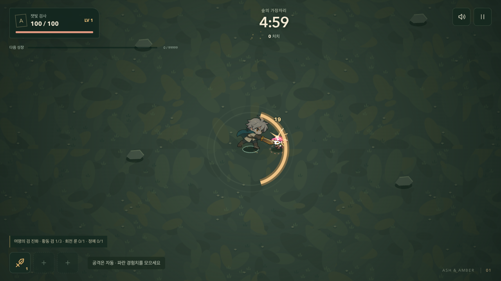
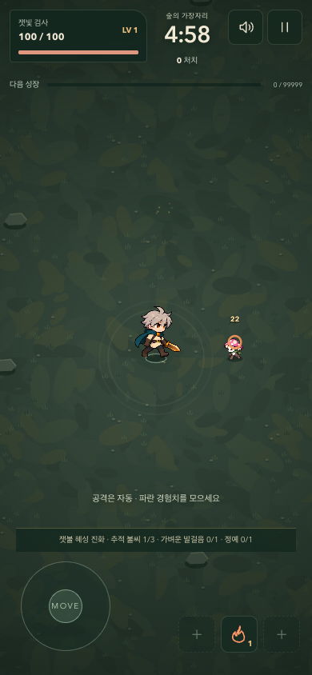

# 기본 무기부터 전달되는 타격감

2026-09-22. ‘공격은 보이지만 맞는 느낌이 부족하다’는 플레이 피드백을 반영했다. 기본 검에서 접촉과 처치를 분명하게 만들고 불·룬에도 같은 기준을 적용한다.

## 표현 기준

- 직접 적중 시 일반 적이 35ms 동안 눌린 자세를 유지한 뒤 180ms 안에 복원된다. 별도 렌더 자세이며 적의 좌표·속도·공격 타이머를 바꾸지 않는다. 정예는 약하게 반응하고 돌진/내려찍기 예고와 군주 자세는 보존한다.
- 검은 날카로운 황금 섬광, 불은 주황 충격 원, 룬은 민트색 마름모로 구분한다. 처치 적중은 표시를 키운다. 무기별 35ms 간격과 기존 효과 120개 상한을 사용한다. 모든 적은 개별적으로 움찔하지만 한 번의 광역 공격에 섬광을 적 수만큼 생성하지 않는다.
- 피해 숫자는 적 머리 위로 올려 접촉 지점의 섬광과 겹치지 않게 한다.
- 일반 적의 처치 잔상은 마지막 직접 적중 방향으로 짧게 튕기며 사라진다. 연소 피해와 유물 피해가 이전 공격의 방향을 잘못 재사용하지 않는다. 보상 생성 위치와 획득 규칙은 유지한다.
- 기본 검에서도 접촉음을 재생한다. 검에는 날카로운 잡음과 저음, 불에는 낮은 폭발 잡음, 룬에는 낮은 충격음을 더한다. 잡음은 재사용하는 0.2초 버퍼로 합성해 다운로드나 전투 난수를 쓰지 않는다.
- 한 프레임에 중요한 알림 하나와 적중음 하나까지 선택한다. 적중음 사이 85ms 간격을 두어 다중 적중 시 과도한 중첩을 막는다. 음소거·일시정지의 기존 오디오 중단을 유지한다.
- 움직임 감소 설정에서는 적의 변형·처치 이동·추가 파편을 없애고 작은 고정형 적중 표시는 남긴다. 전역 정지나 카메라 흔들림은 이번에 추가하지 않았다.

## 검증

변경 전 `743f843`과 변경 후를 6개 경로 × 시드 12/42/99로 비교했다. 같은 입력·실제 강화 선택을 사용한 18판에서 종료 시간, 승패, 처치, 체력, 좌표, 성장, 피해량, 회복, 유물, 사건과 경험치가 정확히 일치했다. [비교 기록](./impact-parity-2026-09-22.json).

코어 76개와 브라우저 56개를 통과했다. 추가 검사는 실제 적중과 빗나감, 기본 검의 처치 보상, 불·룬의 적중, 연소의 반응 재시작 방지, 군중 이펙트 간격, 정지/만료, 예고 자세 보존, 음향 선택 우선순위를 포함한다. 실제 Web Audio 잡음 소스가 검과 불의 적중에서 시작되는 것도 확인했다. 마지막 방향 보완 후 코어 관련 검사와 세 무기의 모바일·움직임 감소 검사를 다시 통과했다.

적 160마리의 12초 로컬 부하 검사에서 1280×720, 390×844, 740×360의 프레임 시간 p95는 각각 16.8/16.8/16.7ms, 50ms 초과 프레임은 모두 0개였다. 물리 모바일 기기의 성능이나 사람의 청감 만족도를 대신하는 수치는 아니다.

인앱 브라우저에서도 일반 시작 → 기본 검 처치 → 첫 성장 → 추적 불씨 선택 흐름을 확인했다. 개발용 장면에서 생성한 정지 캡처는 적중 모양을 검토하기 위한 자료다.

Pages 최종 빌드의 시작·정지, 이미지 로드, QA 전역 제거와 페이지 오류 없음도 통과했다. [로컬 검증 기록](./impact-local-qa-2026-09-22.json).

연속 음향 검사에서는 12초 동안 알림+적중+추가 군중 적중 요청을 132회 묶음으로 재생했다. 관측한 예약 음원 시작은 440회, 연결된 오디오 노드는 최대 17개였고 마지막 소리 이후 0개로 정리됐다. 음소거 상태의 추가 재생은 0회였다. [음향 자원 기록](./impact-audio-soak-2026-09-22.json).

## 다음 개발 기준

먼저 실제 소리를 켠 첫 30초에서 빈 휘두름과 적중을 구별할 수 있는지, 적 여러 마리를 베는 것이 더 만족스러운지 확인한다. 그다음 강한 일격과 정예 처치의 강조, 캐릭터 공격 동작의 준비·회수, 진화 전후의 연출 차이를 순서대로 다듬는다. 전투 규칙과 성능을 유지한 채 각 단계의 차이를 비교한다.

## 공개 배포

실행 커밋 `df830c8`의 [원격 검사와 배포](https://github.com/Seung-Won-Yu/rune-drift-survivors/actions/runs/35681087690)가 성공했다. 코어 76개·새 게임 브라우저 56개·기존 게임 브라우저 86개로 총 218개 검사와 Pages production 검사를 통과했다. 원격 부하 검사 세 화면의 p95는 모두 16.7ms, 50ms 초과 프레임은 모두 0개였다. [CI 기록](./impact-release-ci-2026-09-22.json).

2026-09-22 12:07 KST에 공개 주소의 JS·CSS 해시가 검증한 로컬 빌드와 일치함을 확인했다. 개발 장면 없이 새 게임을 시작해 기본 검의 첫 적중 잡음이 재생됐고, 일시정지와 음소거 중 새 음원이 발생하지 않았다. 390×844에서 가로 넘침이 없고 QA 전역·페이지 오류·HTTP 실패도 없었다. 인앱 브라우저의 공개 시작 화면도 정상 로드됐다. [공개 확인 기록](./impact-public-release-2026-09-22.json).
