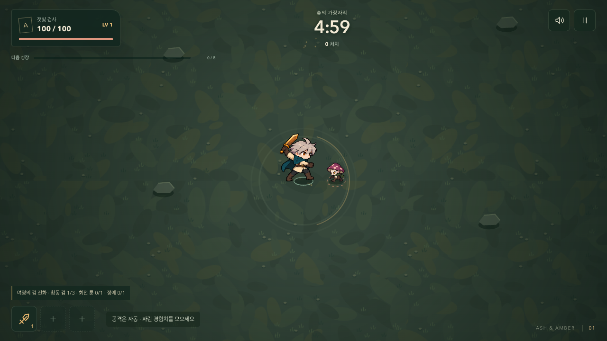
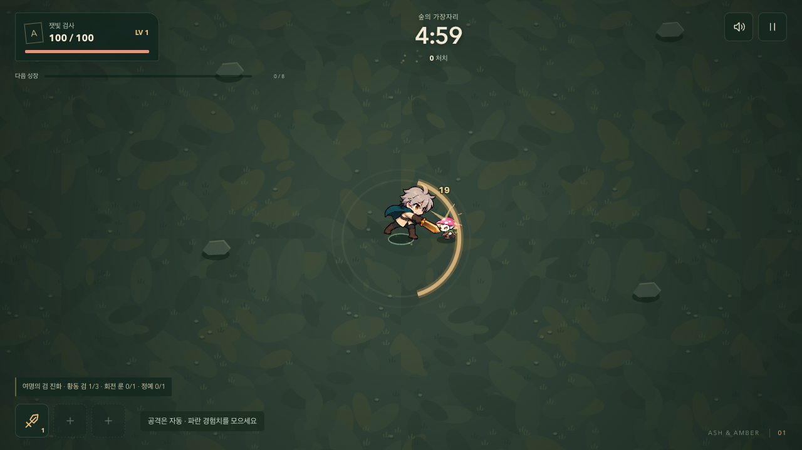
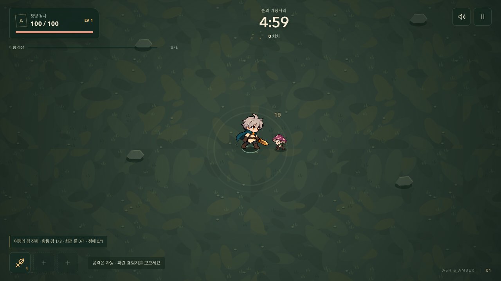
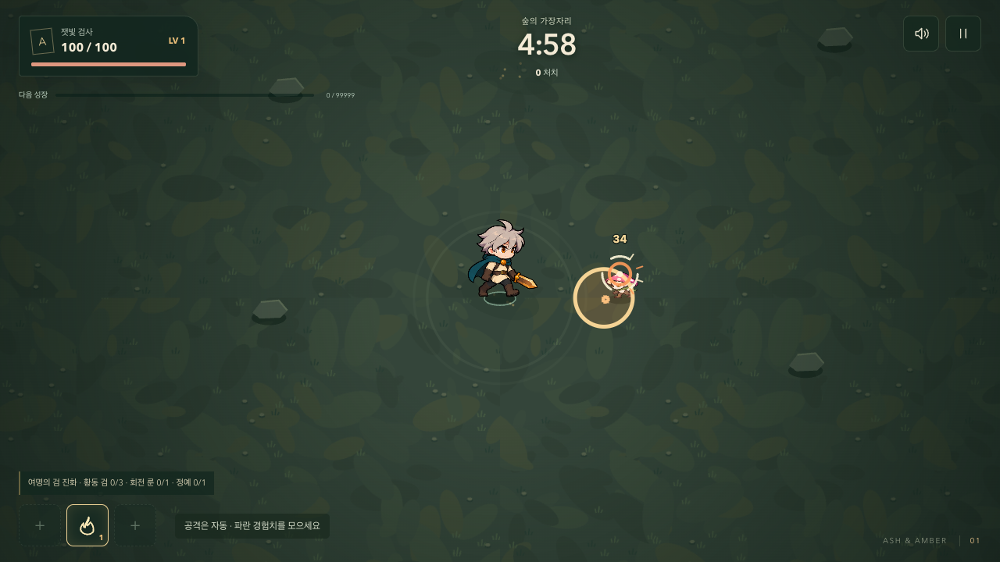
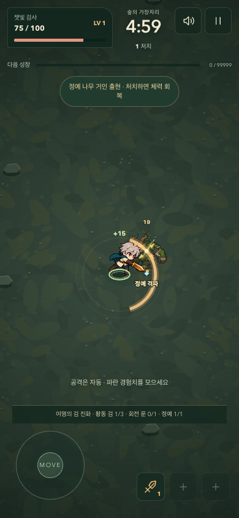

# 공격의 준비·타격·회수와 중요한 처치

2026-09-23. 기본 적중 개선 다음 단계로 캐릭터 동작의 속도 차이, 진화 무기의 접촉 표현, 정예 처치의 구분을 구현한다. 공격 판정과 이동을 유지하는 연출 작업이다.

## 캐릭터 동작

- 검은 기존 0.18초 준비 시간 안에서 점점 힘을 모으는 자세를 취한다. 판정이 발생하는 순간 앞으로 뻗고, 약 0.05초 자세를 유지한 뒤 기존 0.55초 동작 종료까지 부드럽게 복원한다.
- 캐릭터를 그리는 위치·기울기·비율만 바꾼다. 충돌 좌표, 사거리, 실제 밀치기, 공격 주기, 이동 속도는 바뀌지 않는다.
- 불씨 발사에는 짧게 몸을 펴는 반동, 수호자의 시전에는 아래로 버티는 자세를 적용한다. 이미 발사된 투사체를 기다리게 하는 준비 동작은 넣지 않는다.
- 피격과 패배 자세를 우선한다. 일시정지는 게임 시간과 함께 자세를 고정하고, 움직임 감소 설정은 추가 변형을 끈다.

## 진화와 처치의 차이

| 상황 | 추가 표현 |
| --- | --- |
| 여명의 검 적중 | 더 큰 접촉 섬광, 이중 검광, 짧은 고음 잔향 |
| 잿불 혜성 적중 | 끊어진 바깥 충격 고리와 낮은 폭발음 |
| 월광 고리 적중 | 겹친 마름모 문양과 높은 공명음 |
| 정예 처치 | 0.48초의 네 방향 파열 표시, ‘정예 격파’, 접촉음과 구분되는 마무리음 |

진화 표시는 해당 무기의 실제 진화 상태를 읽는다. 일반 강화에 임의의 치명타나 새 피해 보너스를 붙이지 않는다. 정예 처치 표시는 장식 효과 120개 상한과 별도로 하나만 유지해 포화 상태에서도 사라지지 않으며, 일시정지·성장 선택 중에는 멈춘다. 위험 예고와 적 투사체는 이 표시 위에 그린다.

‘정예 격파’ 문구는 피해 숫자와 교차하지 않도록 적의 발밑에 고정하고, 작은 화면에서 읽기 쉽도록 크기를 조정했다.

정예 마무리음은 평범한 적중음과 회복음의 중첩을 대체한다. 플레이어 피격과 군주의 위험 신호는 우선순위를 유지한다. 진화 적중의 추가 음원은 기존 적중음 간격 제한을 함께 사용한다.

## 확인 기준

준비·타격·회수를 구분할 수 있는지, 정예를 쓰러뜨린 순간을 알아볼 수 있는지, 진화 접촉 효과가 기본 무기와 구별되는지 확인한다. 작은 화면과 움직임 감소에서도 표시는 남기되 플레이어와 위험 예고를 가리지 않아야 한다.

코어 검사는 동작의 방향·복원·피격 우선순위, 실제 적중의 진화 표시, 장식 상한에서 정예 표시·정지·만료·보상 유지, 마무리음 우선순위를 다룬다. 브라우저 검사는 준비/타격/회수 캡처, 세 진화 무기의 실제 음원 주파수와 적중 표시, 데스크톱·모바일 정예 처치와 움직임 감소를 다룬다.

변경 전 `c17184e`와 같은 입력을 사용하는 6개 경로 × 시드 12/42/99의 18판에서 종료 시간, 승패, 처치, 체력, 좌표, 성장, 피해량, 회복, 유물, 사건과 경험치가 정확히 일치했다. [전투 비교 기록](./weight-parity-2026-09-23.json). 실제 사람이 느끼는 손맛이나 물리 휴대전화의 성능을 자동 검사 결과로 대신하지 않는다.

## 로컬 검증

코어 80개·브라우저 62개를 통과했고, 처치 문구의 마지막 위치 보완 후 코어 80개와 데스크톱·모바일 정예 검사 2개를 다시 통과했다. 160마리의 12초 부하 검사 p95는 1280×720 / 390×844 / 740×360에서 16.8 / 16.8 / 16.7ms였고 50ms 초과 프레임은 모두 0개였다. Pages 최종 빌드의 시작·정지·이미지 로드·QA 전역 제거도 통과했다. [로컬 검사 기록](./weight-local-qa-2026-09-23.json).

진화 적중과 정예 마무리음을 포함한 12초 연속 음향 검사에서는 132회 묶음, 음원 시작 587회를 관측했다. 연결된 오디오 노드는 최대 28개였고 마지막 소리 이후 0개로 정리됐다. 음소거 중 추가 재생도 0회였다. [음향 자원 기록](./weight-audio-soak-2026-09-23.json).

인앱 브라우저에서는 일반 시작, 기본 검 처치, 첫 성장과 검 강화 후 전투 재개를 확인했다. 아래 이미지는 개발 장면의 실제 시뮬레이션을 멈춘 캡처다.

| 준비 | 타격 | 회수 |
| --- | --- | --- |
|  |  |  |

## 공개 배포

실행 커밋 `9b2dcd5`의 [원격 검사와 배포](https://github.com/Seung-Won-Yu/rune-drift-survivors/actions/runs/35809985326)가 성공했다. 코어 80개·새 게임 브라우저 62개·기존 게임 브라우저 86개로 총 228개 검사와 Pages production 검사를 통과했다. 기존 게임 검사는 이번 실행에서 13분이 걸렸다. 원격 부하 검사 p95는 1280×720 / 390×844 / 740×360에서 33.4 / 16.8 / 16.7ms였고 50ms 초과 프레임은 모두 0개였다. 원격 데스크톱 결과는 로컬보다 느렸으며, 로컬 성능이나 실제 기기의 성능과 동일하게 해석하지 않는다. [CI 기록](./weight-release-ci-2026-09-23.json).

2026-09-23 11:39 KST에 공개 주소의 JS·CSS 해시가 검증한 로컬 빌드와 일치함을 확인했다. 개발 장면 없이 새 게임을 시작해 기본 검의 첫 적중 음원이 재생됐고, 일시정지와 음소거 중 새 음원이 발생하지 않았다. 390×844에서 가로 넘침이 없고 QA 전역·페이지 오류·HTTP 실패도 없었다. 인앱 브라우저에서도 공개 시작 화면이 정상 로드됐다. 공개 주소 확인은 기본 전투 흐름을 대상으로 했으며, 진화와 정예의 상세 연출은 위 개발 장면 검사에서 확인했다. [공개 확인 기록](./weight-public-release-2026-09-23.json).
