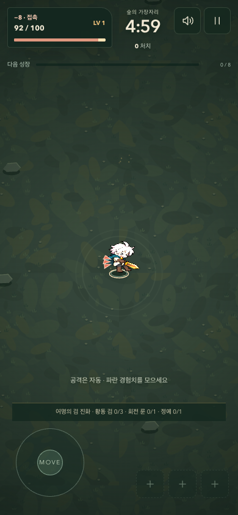
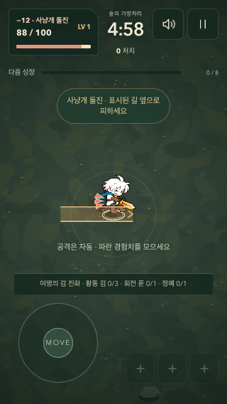

# 공격과 피격을 구분하는 피드백

2026-10-06. 이미 구현한 무기별 적중·진화·정예 처치 표현을 바탕으로, 이번에는 플레이어가 맞은 순간과 회피를 계속하는 구간을 보완한다.

## 조사와 적용 판단

| 1차 자료 | 확인한 원칙 | 이번 게임에서의 적용 |
| --- | --- | --- |
| [Squirrel Eiserloh, GDC 2016: Juicing Your Cameras with Math](https://media.gdcvault.com/gdc2016/Presentations/Eiserloh_Squirrel_JuicingYourCameras.pdf), 9–18쪽 | 충격 연출에는 강도 상한과 감쇠가 필요하며, 흔들림의 과잉 사용을 경계한다. | 피해량에 따라 상한이 있는 반동을 주고 빠르게 복원한다. 이번에는 캐릭터의 표시 위치만 바꾼다. |
| [Xbox Accessibility Guideline 103: Additional channels for audio and visual cues](https://learn.microsoft.com/en-us/xbox/accessibility/xbox-accessibility-guidelines/103) | 중요한 정보를 여러 감각 채널로 전달한다. | 방향 표식·손실 체력·원인·별도 피격음을 같은 실제 피해 기록에 연결한다. 음소거 상태에서도 원인이 남는다. |
| [Xbox Accessibility Guideline 117: Visual distractions](https://learn.microsoft.com/en-us/xbox/accessibility/xbox-accessibility-guidelines/117) | 화면 흔들림 등 불편을 줄 수 있는 움직임을 피하거나 끌 수 있게 한다. | 무적 중 반복 깜빡임을 일정한 보호 표시로 바꾸고, 움직임 감소에서는 반동·체력 잔상 이동을 끈다. |

자료 열람일은 2026-10-06이다. 아래 수치와 HUD 설계는 자료의 정답 수치가 아니라 이 게임에 맞춘 구현 선택이다. 여러 적이 동시에 맞는 자동 전투에서 매 적중마다 전체 화면을 흔들거나 시간을 멈추면 회피 예고를 읽기 어려워질 수 있어 이번에는 적용하지 않았다. 실제 타격감의 선호는 플레이테스트가 필요하다.

## 기존 구현의 빈틈

적에게 주는 타격은 방향별 접촉 섬광·움찔·무기별 소리로 구분됐다. 반면 플레이어는 짧은 흰색 피격 프레임, 확장 원, 단일 저음과 무적 깜빡임을 사용했다. 피격 원은 장식 효과 상한을 공유했고, 실제 손실량과 공격 방향을 표시하지 않았다. 피격과 일반 적중음도 같은 프레임에 겹칠 수 있었다.

## 구현 계약

- 접촉·사냥개 돌진·포자·내려찍기·군주 돌진·가시의 실제 피해 처리 시점에 손실 체력, 직전 체력, 원인, 공격이 온 방향을 기록한다. 방어 경감과 남은 체력 제한을 적용한 결과를 사용한다. 무적 중 거부된 공격은 재생하지 않는다.
- 한 개의 최신 피격 기록만 유지한다. 장식 효과 120개 상한과 분리하고, 난수·피해량·무적 시간·충돌 좌표·이동 속도·공격 주기를 바꾸지 않는다.
- 몸의 반동은 기존 피격 동작 0.24초 안에서 최대 10 월드 단위로 제한해 감쇠한다. 충돌과 이동은 계속된다. 공격 위치와 플레이어가 정확히 겹치면 방향을 추측하지 않고 중립 표식을 사용한다.
- 피격 표식은 최대 0.42초간 캐릭터 근처에 나타난다. 공격 예고와 적 투사체는 그 위에 그린다. 무적 동안 발밑에 일정한 보호 윤곽을 남기고 캐릭터는 보이게 유지한다.
- 기존 이름 줄을 0.95초간 손실량·원인으로 바꿔 HUD 높이를 늘리지 않는다. 체력은 즉시 갱신하고 손실 잔상은 0.2초 유지 후 0.55초간 줄어든다. 회복한 체력을 다시 손실처럼 표시하지 않는다.
- 피격음은 짧은 잡음과 낮게 떨어지는 두 음원을 결합한다. 같은 프레임의 일반 적중음은 제외하고, 이후 0.18초 동안 일반 적중·수집 소리를 억제한다. 중요한 위험 예고는 계속 허용한다. 이미 재생 중인 짧은 소리 꼬리를 강제로 끊지는 않는다.
- 움직임 감소에서는 몸의 반동과 체력 잔상 이동을 없애고, 고정된 방향 표식과 피해량·원인은 유지한다. 피격 기록은 게임 시간을 사용하므로 일시정지와 성장 선택 중 멈추고 새 판에서는 초기화된다.

## 검증

신규 코어 검사는 여섯 피해 원인의 전달, 실제 손실량, 무적 중 중복 방지, 장식 포화 상태, 반동 중 정상 이동, 정지·만료·회복·초기화·남은 체력보다 큰 피해의 처리를 확인한다. 브라우저 검사는 1280×720 / 390×844 / 320×568의 표시와 움직임 감소, 실제 Web Audio의 피격 우선권과 일반 적중 재개를 확인한다.

변경 전 `f142c74`와 동일한 자동 입력을 사용하는 6개 경로 × 3개 시드의 18판에서 종료 시간·결과·레벨·처치·체력·전문화·유물·이벤트·피해·회복·최대 적 수 기록이 전부 일치했다. 사람의 체감 평가와 구분한다.

실제 플레이테스트에서는 음소거 상태에서도 어디서 맞았는지 설명할 수 있는지, 무리 속에서도 피격음을 구분하는지, 피격 후 원하는 방향으로 피할 수 있는지 확인한다. 손맛과 스릴이 완성됐다는 결론은 자동 검사만으로 내리지 않는다.

## 로컬 확인 결과

코어 82개·브라우저 66개 전체 검사와 추가한 320px 긴 원인 문구 검사 1개를 통과했다. Pages 빌드와 production 검증도 통과했다. 세 부하 화면의 p95는 모두 약 16.8ms, 50ms 초과 프레임은 0개였다. [로컬 기록](./hurt-local-qa-2026-10-06.json) · [18판 비교 기록](./hurt-parity-2026-10-06.json).

인앱 브라우저에서는 개발 장면 없이 시작해 포자로 6 피해를 받은 뒤 첫 성장에 도달했다. 검 2단계 선택 후 `−6 · 포자`, 체력 94/100과 전투 재개를 확인했다. 실제 모바일 기기와 사람의 주관적인 음향 선호는 검증하지 않았다. 아래는 실제 피해를 발생시킨 개발 장면 캡처다.

## 공개 배포 확인

실행 커밋 `3106999`의 [전체 검사와 Pages 배포](https://github.com/Seung-Won-Yu/rune-drift-survivors/actions/runs/37393811489)가 성공했다. 코어 82개·새 게임 브라우저 67개·기존 게임 브라우저 86개로 총 235개 검사와 production 검증을 통과했다. 원격 부하 검사 p95는 1280×720 / 390×844 / 740×360에서 33.4 / 16.7 / 16.7ms였고 50ms 초과 프레임은 1 / 0 / 0개였다. 원격 실행 환경의 결과이며 물리 휴대전화의 성능을 의미하지 않는다. [CI 기록](./hurt-release-ci-2026-10-06.json).

2026-10-06 09:46 KST에 공개 JavaScript·CSS 해시가 검증한 로컬 빌드와 일치함을 확인했다. 첫 제자리 플레이는 45초 관찰 안에 피해가 발생하지 않아 피격 확인에 사용하지 않았다. 이후 새 판에 정상 이동 입력을 넣어 접촉 피해를 받았고 `−8 · 접촉`, 체력 92/100, 직전 체력의 잔상 100%, 새 피격음의 두 음원 시작(145Hz·72Hz)을 확인했다. 게임 상태·체력·적을 직접 조작하거나 개발 장면을 사용하지 않았다. 일시정지·음소거 중 새 음원 설정은 없었고, 390×844 가로 넘침과 페이지/HTTP 오류도 없었다. 개발용 QA 전역은 제거돼 있었다. 인앱 브라우저에서는 공개 시작 화면의 정상 로드를 확인했다. [공개 확인 기록](./hurt-public-release-2026-10-06.json).
