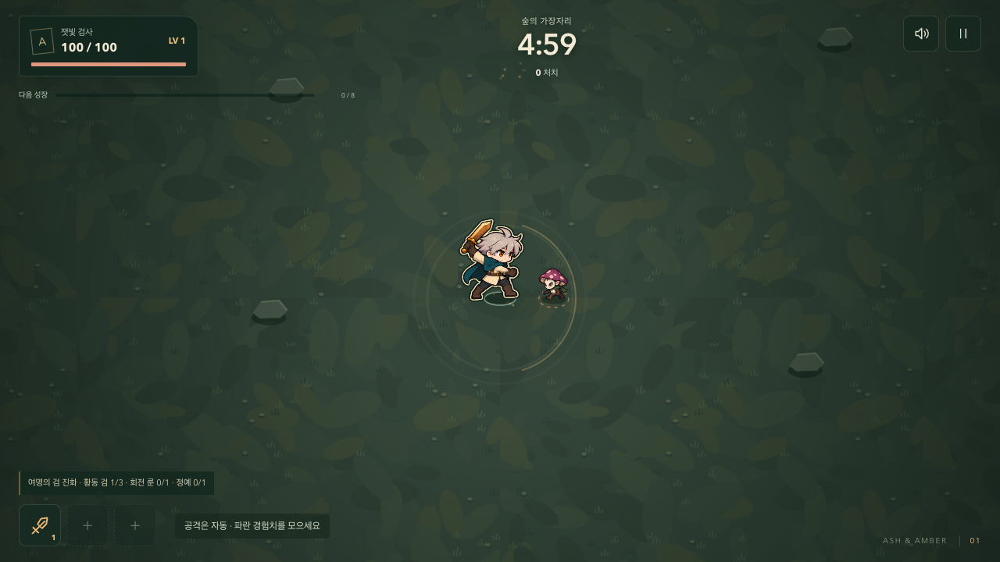
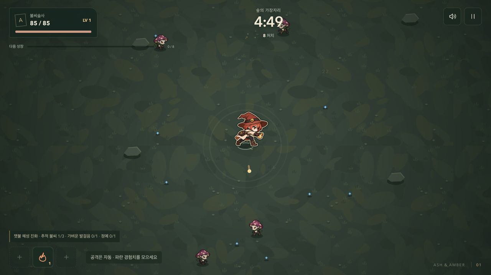

# 전투 가독성과 캐릭터 움직임

2026-10-06 · 첫 챕터의 콘텐츠를 유지하고 밀집 전투의 표시와 기존 그림의 움직임을 보강한다. [앞선 챕터 마감](./20-CHAPTER-FINAL-AUDIT.md) 다음 작업이다.

## 문제와 변경

앞줄의 적과 아군 폭발이 플레이어를 가렸다. 포자/사냥개 예고는 효과보다 위에 있었지만 거인·정예·군주의 예고는 같은 원칙을 따르지 않았다. 고정된 프레임 기준점과 입력 크기에 무관한 발걸음은 일부 동작에서 미끄러지는 느낌을 만들었다.

| 보강 | 현재 동작 |
| --- | --- |
| 내 캐릭터 식별 | 적과 아군 효과 다음에 동료를 한 번 그린다. 기존 그림의 색을 유지하고 얇은 밝은 경계와 어두운 외곽을 캐시한다. |
| 위험 예고의 우선순위 | 포자·사냥개·일반 거인·정예 내려찍기·군주 돌진·군주 가시의 예고선을 동료와 아군 효과 위에 그린다. 옅은 범위 채움은 바닥에 남기고 예고선에 어두운 밑선을 둔다. |
| 밀집 전투의 정보량 | 동료 주변 240 단위에 적 12마리 이상이면 가까운 피해 숫자 8개만 표시한다. 160 단위보다 먼 적의 불꽃 장식을 3개에서 1개로 줄인다. 한산해지면 전체 숫자 표시로 돌아온다. |
| 발 접지와 보폭 | 각 동료 프레임의 마지막 불투명 행을 발 기준점으로 사용한다. 실제 이동 거리로 걷기 시계를 갱신하며 터치 스틱의 약한 입력과 동료별 속도를 반영한다. |
| 동료별 움직임 | 검사 기본 보폭, 술사 가벼운 보폭, 수호자 작은 상하 이동을 구분한다. 공격·시전·피격·쓰러짐 자세가 걷기보다 우선한다. |
| 적의 움직임 | 버섯의 작은 뛰기, 사냥개의 낮은 보폭, 거인의 무거운 흔들림을 구분한다. 돌진 준비의 압축과 내려찍기 준비의 들어올림을 점진적으로 키우고 공격 뒤 원래 자세로 돌아온다. |

걷기와 준비 동작은 시뮬레이션 시계를 사용하므로 일시정지 중에 진행하지 않는다. 모션 감소 설정에서는 추가 들썩임·기울기·압축을 끄고 위험 예고와 캐릭터 경계는 유지한다. 충돌체·피해·공격 타이밍·위험 범위·난수·해금 조건은 바꾸지 않는다.

플레이어 프레임과 경계는 한 번 만들고 재사용한다. PNG 원본을 수정하거나 매 프레임 필터를 적용하지 않는다. [그림 출처와 남은 포즈 한계](../../../public/art/survivor/README.md).

## 검증

- 로컬 `npm run qa:survivor`: 코어 **101개**, 브라우저 **86개** 통과, 종료 코드 0. 새 검사는 이동 거리/자세 우선순위/적 준비·복귀의 3개 코어 검사와 실제 Canvas 픽셀/숫자 표시의 5개 브라우저 검사다.
- 1280px·320px, DPR 2에서 동료 몸의 픽셀이 앞줄 적과 불씨 폭발 아래로 가려지지 않는지 확인했다. 위 여섯 종류의 위험 예고선도 같은 조건에서 검사했다. 숫자 표시는 20개→가까운 8개→20개로 복귀하고 게임 상태는 렌더링 전후 일치한다.
- 같은 픽셀/표시 검사 5개를 변경 전 `ee45b6f`의 렌더러에 적용하면 모두 실패한다. 변경된 코드는 모두 통과해 실제 이전 문제를 검출하는지도 대조했다.
- 정상 입력 6갈래 × 시드 3개의 18경로 결과가 [앞선 전투 진단](./choices-balance-2026-10-06.jsonl)과 바이트 단위로 일치한다. 이 결과는 게임 규칙 유지의 근거이며 사람의 승률/재미 평가가 아니다.
- 최대 부하 12초, 적 160마리: 1280×720 p95 **16.8ms**, 390×844·740×360 **16.7ms**. 각 50ms 초과 프레임은 0. 로컬 Chrome 측정이며 실제 휴대전화 성능과 구분한다.
- Pages용 production 빌드, 하위 경로, PNG 5개, 시작/정지, QA 전역 제거 검사가 통과했다. HTTP/페이지 오류는 0이다.
- 인앱 일반 UI에서 불씨술사를 선택해 정상 전투와 일시정지를 확인했다. 그림의 본래 색과 발 위치가 유지된다.

[로컬 검사 JSON](./motion-local-qa-2026-10-06.json). 실제 시간 전체 플레이와 원격/공개 배포 검수는 아래에 기록한다.

### 실제 시간 전체 플레이

설치된 Playwright Chromium, 정상 이동/선택 입력, 시드 42, 동료별 독립 브라우저 실행. 정예 3마리·진화·두 사건·유물 2개·결과 저장·같은 동료로 재시작·다음 실험 표시를 각각 검사했다. 소스를 고정한 전체 명령이 3 passed와 종료 코드 0으로 끝났다. 페이지 예외와 50ms 초과 프레임은 모두 0이다.

| 동료 | 게임 초 | 결과 | 처치 | 실제 경과 초 | 프레임 p95 ms |
| --- | --- | --- | --- | --- | --- |
| ash | 259.17 | victory | 808 | 260.127 | 9.0 |
| ember | 293.78 | victory | 828 | 295.037 | 9.1 |
| grove | 300 | survived | 827 | 300.247 | 9.1 |

[전체 플레이 JSON](./motion-fullrun-2026-10-06.json). 이 수치는 로컬 Playwright Chromium의 측정이며 앞선 Chrome 최대 부하나 물리 기기와 구분한다. 게임 초·승패·성장·피해·보상은 앞선 [챕터 전체 플레이](./chapter-fullrun-2026-10-06.json)와 동일하다.

## 화면

[390px 최대 부하](./images/motion-crowd-390.png) · [같은 조건의 흑백 검수](./images/motion-crowd-gray-390.png).

최대 부하 장면은 적 160마리를 영구 생존시키는 개발 조건이다. 캐릭터 경계와 예고선은 유지되지만 적 실루엣은 여전히 겹친다. 이 장면을 정상 플레이의 가독성이나 즐거움의 증거로 사용하지 않는다.

## 다음 판단

먼저 사람의 실제 5분 플레이와 휴대전화에서 현재 챕터를 평가한다. 새로운 지도·무기·장기 성장 시스템의 우선순위는 그 결과를 바탕으로 정한다.

| 관찰할 항목 | 이후 개발 판단 |
| --- | --- |
| 맞은 직후 공격 원인과 피할 방향을 설명할 수 있는가 | 놓치는 위협의 예고와 효과 겹침을 조정한다. |
| 성장 선택에서 기대하는 변화와 실제 플레이가 연결되는가 | 설명·차별화·선택 후보를 손본다. |
| 처치와 수집의 정리 시간에 다음 목표가 보이는가 | 공세 리듬과 경험치/회복 배치를 조정한다. |
| 종료 뒤 다른 빌드를 시도하고 싶은 이유가 있는가 | 발견/다음 실험 연결을 다듬고 필요한 콘텐츠를 고른다. |
| 휴대폰에서 이동·선택·위험 식별과 5분 유지가 되는가 | 터치 영역·표시 밀도·렌더링 비용을 측정해 조정한다. |

물리 저사양 기기의 발열/메모리, iOS Safari, 사람의 재미·스릴·재도전 의사는 아직 미검증이다. 기존 4포즈·좌우 반전·일부 의상/검 끝 잘림의 자산 한계도 유지한다.

## 전달 상태

실제 시간 전체 플레이와 로컬 검수를 마쳤다. main 커밋·푸시, 원격 검사, 공개 배포 파일과 실행을 확인한 뒤 최종 전달 기록을 갱신한다.
