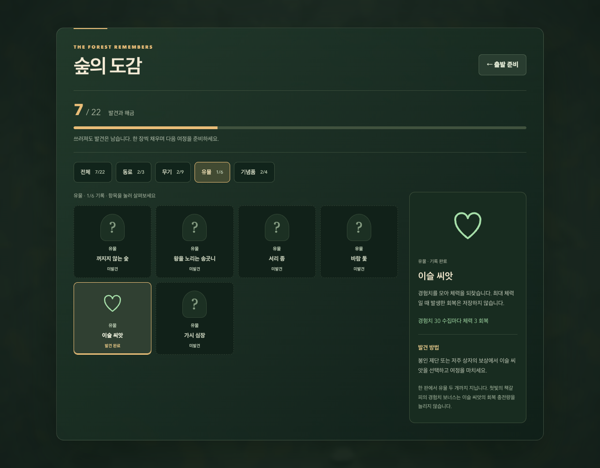

# 숲의 도감과 출발 준비

2026-10-06. 플레이에서 얻은 발견을 로비 수집 목표와 다음 출발의 선택으로 연결한다.

## 플레이 경험과 참고

플레이어는 숲에서 서로 다른 힘을 발견하고, 도감을 채우며, 얻은 기념품으로 다음 판의 출발을 바꾼다.

| 단계 | 행동과 보상 |
| --- | --- |
| 순간 | 공격·회피하며 경험치를 모으고 성장 카드를 고른다. |
| 한 판 | 전문화·진화·유물을 선택하고 여정을 마치면 새 페이지가 기록된다. 패배도 발견을 남긴다. |
| 다음 출발 | 수집 조건으로 열린 기념품을 선택하고 다른 동료·빌드로 미발견 항목에 도전한다. |

Vampire Survivors의 개발자 페이지는 판에서 골드를 얻어 다음 생존자를 강화하고, 시작 파워업에 골드를 사용하는 구조를 설명한다. 커뮤니티 위키의 Growth는 경험치 획득량을 올리는 파워업이다. 수집·해금과 판 사이 강화는 연결하되 별도 역할로 이해했다. 이번 구현은 기존 도전 보상을 출발 선택으로 연결하고, 수집에 따른 작은 초반 성장 보상을 더한다. 이는 우리 게임의 설계이며 Vampire Survivors의 수치나 경제를 그대로 복제한 것이 아니다.

- [개발자 poncle의 Vampire Survivors 웹 데모·설명](https://poncle.itch.io/vampire-survivors): 골드와 다음 판 파워업의 연결. 페이지의 데모 콘텐츠 수는 현재 Steam판의 콘텐츠 수로 사용하지 않았다.
- [Vampire Survivors PowerUps 위키](https://vampire-survivors.fandom.com/wiki/PowerUps): Growth의 경험치 증가와 판 사이 파워업. 커뮤니티 자료이며 개발자의 밸런스 기준으로 취급하지 않았다.

## 도감 22개

| 분류 | 항목 수 | 기록 근거 |
| --- | --- | --- |
| 동료 | 3 | 기존 동료 해금 조건 |
| 무기 | 9 | 전문화 6개 + 진화 3개 발견 기록 |
| 유물 | 6 | 유물 발견 기록 |
| 기념품 | 4 | 숲의 도전 해금 조건 |

‘빈손의 여정’은 기본 선택이므로 수집 수에 넣지 않는다. 도감에는 전체·분류별 진행도, 기록 상태, 설명, 효과, 발견 조건과 진화 조합을 표시한다. 미발견은 물음표 그림과 점선 테두리로 표시하면서 이름·방법을 공개해 다음 목표를 고를 수 있게 한다.

도감은 기존 저장 데이터를 읽으며 열람으로 해금을 얻거나 기록을 쓰지 않는다. 무기·유물의 전투 능력은 판에서 다시 얻는다. 과거 기록에서 추정할 수 없는 적·기본 무기 수집을 만들어내지 않는다.

## 출발 준비와 성장 보상

동료 선택 아래, 시작 버튼 앞에서 기념품 하나를 선택한다. 선택한 시작 무기, 실제 최대 체력, 이동 속도와 기념품 효과를 함께 보여준다. 선택은 재시작·새로고침에도 유지하고 중첩하지 않는다.

| 선택 | 해금 | 효과 |
| --- | --- | --- |
| 빈손의 여정 | 처음부터 | 기본 능력 |
| 제단의 씨앗 | 제단을 완료한 여정 1회 | 수집 거리 +28, 최대 체력 −10 |
| 갈림길의 리본 | 서로 다른 전문화 2개 | 이동 +12, 최대 체력 −10 |
| 재의 왕관 조각 | 군주 격파 1회 | 최대 체력 +15, 이동 −8 |
| 첫빛의 책갈피 | 서로 다른 전문화·진화·유물 총 3개 | 첫 60초 획득 경험치 +20% |

책갈피는 게임 시간 60초 미만에 실제로 수집한 경험치에 적용한다. 일시정지 중 시간은 흐르지 않는다. 이슬 씨앗의 회복 충전은 원래 경험치 수집량을 사용하여 보너스가 회복까지 증폭시키지 않는다. 일시정지·결과에서 남은 시간 또는 효과 종료를 표시한다. 20%와 60초는 실제 플레이 반응으로 조정할 초기값이다.

첫 세 장의 기록은 서로 다른 전투 발견만 센다. 동료 해금이나 도전 보상을 다시 발견으로 세는 순환 해금은 없다. 기존 기록에 발견 3개가 있으면 바로 기념품을 선택할 수 있고, 같은 발견을 반복해도 숫자는 늘지 않는다.

## 화면과 저장

로비의 도감 진입 버튼에 22개 진행도와 책갈피 해금 진행을 노출한다. 별도 도감 화면은 필터·카드·설명으로 구성한다. 데스크톱 설명은 목록 옆에 놓고, 모바일에서는 선택 후 설명으로 이동하고 목록 복귀 버튼을 제공한다. 44px 이상 주요 조작, Tab/Enter 선택, Escape/P 복귀와 포커스 복원을 검증한다.

`ash-profile-v1`을 유지한다. 새 보상은 기존 발견 배열에서 판정하므로 저장 형식 변경이 없다. 기존 기록 정규화, 중복 여정 방지, 저장 실패 시 현재 창 사용, 미래 버전 보존 정책을 계속 적용한다.

## 화면 근거

로컬 브라우저 QA에서 저장 복원을 검증한 부분 수집 기록(7/22)이다. 실제 사용자 수집 실적을 주장하는 자료가 아니다. 데스크톱 화면 검사는 1280×720에서 실행했고, 설명 전체를 보여주는 위 이미지는 1280×1000으로 캡처했다.

## 검증 기록

- 코어 107개·브라우저 91개 통과. 새 검사에는 기존 기록 복원, 실제 여정 종료를 통한 해금, 중복 발견 방지, 시간 경계의 경험치 적용, 이슬 회복 충전 보존, 선택 저장·재시작, 도감 열람의 저장 무변경을 포함했다.
- 도감 최종 스타일 조정 후 관련 브라우저 4개, 최종 설명·이미지 반영 후 화면 3개 통과. 데스크톱 1280×720, 모바일 320×568, 가로 740×360의 분류·선택·44px 조작·화면 폭·목록 복귀·출발을 확인했다.
- Pages 경로 production 빌드 성공. 실제 production 경로에서 도감 22개, 무기 페이지 9개, 진화 조합, 기본 상태의 성장 기념품 잠금, 시작·일시정지와 QA 도구 부재를 별도 확인했다.
- 정상 규칙 15판(동료 3명 × 출발 설정 5개, 시드 42) 종료·개체 상한 확인. [전체 경로 결과](./codex-balance-2026-10-06.json).

| 자동 경로 | 빈손 레벨 5 도달 | 책갈피 레벨 5 도달 |
| --- | --- | --- |
| 검사 | 35.40초 | 27.82초 |
| 불씨술사 | 35.17초 | 28.62초 |
| 룬 수호자 | 33.58초 | 30.80초 |

60초 시점의 정수 레벨은 각 경로에서 같았지만 중간 성장 선택의 시점은 빨라졌다. 책갈피 경로의 최종 결과는 검사 승리·불씨술사 패배·룬 수호자 생존이었다. 입력과 선택이 진행 상황에 따라 달라지는 자동 경로 한 시드의 결과이며, 승률이나 사람의 체감 성장을 입증하지 않는다. 실제 플레이에서 초반 전문화 도달 체감, 수집 목표 이해와 반복 피로를 확인해야 한다.
