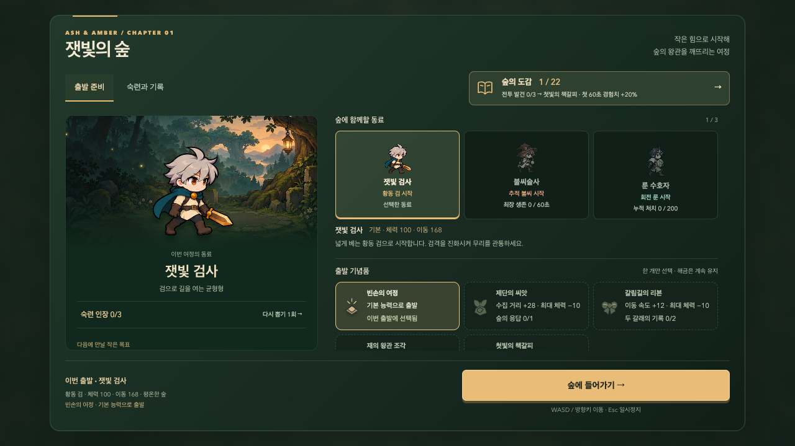
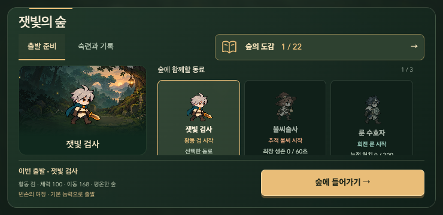

# 잿빛의 숲 — 화면과 플레이 표현의 완성도 개발

2026-10-07. 사용자의 ‘할 수 있는 모든 방법으로 디밸롭’ 목표를 이어간다. 기능 검사만으로 시각 완성이나 사람의 재미를 단정하지 않는다. 기존 2D 카툰·숲과 황금색·5분 전투·해금 기록·한 화면 안의 스크롤을 유지하며, 실제 화면과 정상 플레이에서 확인한다.

## 완료 대조표

| 요구 | 확인할 근거 | 상태 |
| --- | --- | --- |
| 로비에서 곧바로 출발 | 데스크톱·세로·가로에서 시작 버튼이 최초 표시와 내부 스크롤 후에도 화면 안에 있고 문서가 스크롤되지 않음 | 완료 |
| 출발 준비와 기록의 구별 | 동료·기념품·난이도·목표 선택은 준비, 숙련·도전·최근 여정은 기록; 키보드 이동·도감 귀환·선택 변경·저장 복원 | 완료 |
| 세계관과 캐릭터를 살리는 로비 | 전용 야영지 그림, 읽히는 텍스트, 캐릭터 실루엣; 실제 화면 검수 및 자산 출처 기록 | 완료 |
| 모으고 싶은 도감 | 각 무기·유물·기념품의 서로 다른 그림, 미발견 실루엣, 실제 발견 후 공개, 정확한 조건·목표·완성 표시 | 완료 |
| 획득과 다음 출발의 연결 | 실제 새 발견만 강조, 새 해금·숙련·진화의 연출, 결과→도감/준비→재도전 | 완료 |
| 캐릭터 동작의 완성도 | 공격 준비·접촉·후속 동작·복귀 및 캐릭터별 무게 차이; 피격 우선·감소 모션·정지·렌더 순수성 | 완료 |
| 전투 가독성과 긴장 유지 | 플레이어·위험 예고가 효과 위에 유지, 연출 상한·후반/밀집·음향·성능, 기본 판정/전투 결과 회귀 | 완료 |
| 전달 가능한 품질 | 전체 관련 검사·정상 전체 플레이·프로덕션 빌드·기존 게임 회귀·문서·main·공개 배포 대조 | 완료 |

새 기능을 무한히 쌓는 대신 현재 첫 챕터 전체의 화면·동작·수집·성장·재도전이 서로 맞는지 확인한다. 8개 요구의 구현·관련 검사·정상 전체 플레이·main 전달·공개 대조를 모두 확인했다. 사람의 즐거움과 물리 휴대폰 성능은 자동 입력 결과와 구별한다.

## 구현

- 로비의 제목·탭·도감 진입·출발 요약·시작 버튼을 고정했다. 준비에서는 동료/목표/기념품/서약, 기록에서는 숙련/도전/최근 여정을 확인한다. 문서 전체와 패널은 스크롤하지 않으며 긴 작업 영역만 내부에서 스크롤한다. 작은 모바일은 장식 무대를 접어 선택 공간을 확보한다. 저장 실패 안내는 탭 밖의 한 곳에 남는다.
- 야영지 배경은 전용 생성 그림을 WebP로 인코딩했다. 원본과 같은 1536×1024 해상도, 203,986바이트이며 전투 자산을 추가로 바꾸지 않는다. [정확한 프롬프트·출처](../../../public/art/survivor/CAMP-PROMPT.md).
- 19개 비동료 수집 항목과 시작 무기 3개·빈손에 서로 다른 SVG 그림을 만들었다. 미발견은 그 그림의 단색 실루엣이다. 도감/기념품/성장/유물/첫 발견에서 같은 그림을 사용하며 기존 22개 수집 모델과 실제 발견 조건을 유지한다.
- 실제 여정 종료에서 처음 얻은 항목만 발견 카드로 강조하고 해당 도감 페이지로 연결한다. 데스크톱에서는 해당 카드, 모바일에서는 상세 제목으로 포커스를 옮긴다. 결과 본문만 스크롤하며 재도전·동료 선택은 화면에 남는다.
- 검 동작을 준비→접촉→후속 동작→복귀로 나눴다. 동료별 시전 자세와 정지 호흡을 더하고 진화 선택 때 작은 파편·이름을 1.35초 표시한다. 피격·쓰러짐을 우선하고 전투 시간이 멈추면 연출도 멈춘다. 감소 모션에서는 추가 움직임/파편을 없앤다. 렌더링은 실제 전투나 무작위 상태를 바꾸지 않는다.
- 기존 네 포즈 시트의 보간과 변형을 사용했다. 새 방향별 애니메이션이나 프레임을 제작한 것은 아니며 [시트의 한계](../../../public/art/survivor/README.md)를 유지한다.

## 검증

코어 124개와 브라우저 전체 108개는 최종 실행 커밋의 원격 검사에서 모두 통과했다. 로컬 실행에서 발견한 저장 실패 안내 중복과 결과 폭 제한을 수정하고 해당 저장/준비/결과 동선을 재검증했다. 1280×720, 1280×600, 390×844, 320×568, 740×360에서 고정 출발/내부 스크롤/기록/도감 귀환/선택/시작을 검증한다. 결과는 PC·320px·가로 화면에서 두 다음 행동과 발견 포커스를 확인한다.

정상 규칙 120판의 모든 행은 이전 출시 결과와 일치했다. 자동 입력 기준 기본 19/30, 목표 23/30, 숙련 19/30, 짙은 안개 16/30 군주 격파이며, 동료별 모든 모드에 격파 경로가 있고 숙련 인장 3개를 얻을 수 있다. 이는 난이도 회귀 진단이며 사람의 승률이나 재미 평가가 아니다. 실제 시간 전체 여정 3판과 production 경로 검증을 통과했다. 검사는 PC 269.03초(812처치·20레벨), 수호자는 가로 274.17초(801처치·20레벨), 술사는 세로 280.97초(819처치·19레벨)에 군주를 격파했다. 세 판 모두 목표 진화·유물 2개·사건 2개·성장 다시 뽑기·도감/숙련 기록·새 판 초기화를 확인했고 오류가 없었다. 로컬 headless Chromium의 프레임 간격 P95는 세 판 모두 10ms이며 물리 휴대폰 수치가 아니다. 최종 로비 그림/텍스트 간격은 이후 화면 전용 수정과 8개 레이아웃 검사로 다시 확인했다.

Pages 하위 경로 build/preview에서 22개 도감·조합·해금 잠금·두 로비 탭·출발/일시정지·동료/적/군주 5개 시트와 새 배경 로딩을 확인했다. QA 전역은 배포 빌드에 없고 콘솔/HTTP 오류가 없다. 최종 main CI와 공개 자산/화면 대조도 통과했다.

사람의 즐거움·재방문율과 물리 휴대전화의 프레임/발열은 이 자동 검사의 결론에 포함하지 않는다. 출시 범위는 첫 챕터의 현재 수집·빌드·적·보스·재도전이며, 추가 콘텐츠는 실제 플레이 관찰로 판단한다.

## 화면 근거

아래는 초기 기록(1/22)으로 실행한 최종 로컬 화면이다. 도감 수집·능력은 부여하지 않았다.

## 실제 플레이에서 판단할 것

- 첫 1분: 이동하면서 경험치를 주울 수 있고, 성장 카드의 효과/현재 체력/전문화 조건을 읽고 선택할 수 있는가.
- 밀집 전투: 자신의 위치와 적 예고를 찾고, 피격 방향/원인과 공격 적중을 구별할 수 있는가. 움직임 감소에서도 같은 정보를 얻는가.
- 한 판 종료: 실제 새 발견이 무엇인지 이해하고, 그 도감 페이지 또는 다음 빌드로 자연스럽게 이동하는가. 다른 갈래·진화·기념품을 목표로 다시 시작하고 싶은가.

이 관찰과 실기기 확인을 바탕으로 이후 간격·그림·동작·난이도를 조정한다. 현재 시각 방향을 더 높은 품질의 기준안으로 삼되 영구히 고정됐다고 판단하지 않는다.

## 최종 전달

실행 커밋 `b21cacf3ff14a69ea3f7f05a817aa0a721e74409`의 main 푸시와 [원격 검사·Pages 배포](https://github.com/Seung-Won-Yu/rune-drift-survivors/actions/runs/37554361561)가 성공했다. 코어 124개, 새 게임 브라우저 108개, 기존 3D 브라우저 86개, production 검사가 통과했다.

WebKit와 Firefox의 추가 핵심 검사도 각각 16개 흐름을 확인했다. 키보드·터치·고정 출발·도감/결과 포커스 등 13개는 최초 실행에서 통과했고, 진화 3종의 즉시 감소 모션 assertion은 기존 MediaQueryList의 다음 프레임 전파 시점 때문에 실패했다. 초기 감소 모션 설정과 실제 다음 프레임의 파편 0개·정지 시간 불변을 별도 진단했다. 제품 코드는 바꾸지 않고 검사만 실제 설정 전파를 기다리게 했으며, 해당 3개를 Chromium·WebKit·Firefox에서 모두 재검증했다. 물리 Safari/iPhone/Android 및 사람의 재미를 입증하는 검사는 아니다.

[공개 게임](https://seung-won-yu.github.io/rune-drift-survivors/survivor/)에서 JS·CSS·야영지 WebP의 SHA-256이 로컬 Pages 빌드와 일치했다. PC 1280×720, 세로 390×844, 가로 740×360에서 22개 도감·19개 미발견 실루엣·고정 출발·기록 탭·목표 선택/재로드 유지·출발/일시정지를 확인했다. 문서 가로/세로 overflow는 0, QA 전역은 없으며 콘솔/HTTP 오류도 없다. Codex 인앱 브라우저의 실제 공개 로비에서도 기존 동료·발견·목표 기록이 유지된 새 화면을 확인했다.

| 공개 파일 | 바이트 | SHA-256 |
| --- | ---: | --- |
| survivor-COzwCodS.js | 131403 | `5c73756ce733ac574280f32dd13c0569b01bf3ddf07ff07f3700296d837d1cac` |
| survivor-5UVtTVes.css | 51231 | `3373d6e6dcfeaecd5c9481b69146eb49e754e3bd68ddf561485ff4e5cc63789a` |
| forest-camp-v1.webp | 203986 | `99a5b36bd694f6df6d47111fe4e00295548c34ba5a9e9bc1794e71091f69a512` |

실행 코드와 자산을 바꾸지 않는 마지막 검증 기록·검사 동기화 커밋에는 `[skip ci]`를 사용한다. 출시는 위 실행 커밋의 전체 CI와 실제 공개 파일 대조로 검증했으며, 이후 변경한 진화 검사 3개는 세 엔진의 관련 검사로 확인했다. [GitHub의 커밋 단위 실행 생략 문서](https://docs.github.com/en/actions/how-tos/manage-workflow-runs/skip-workflow-runs).
