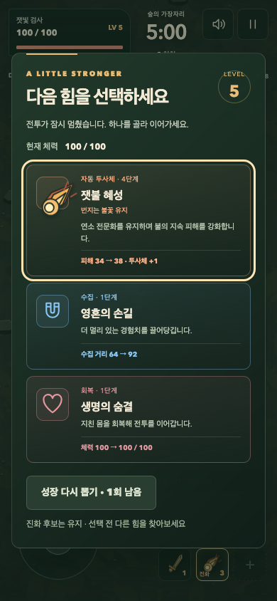

# 잿빛의 숲 — 성장한 무기가 화면에서도 이어지도록

2026-10-07. 2D 카툰·짙은 숲·황금색의 방향을 유지하며 전투의 성장 표현을 보강했다. 현재 디자인은 실제 플레이로 조정하는 기준안이며, 미술과 재미의 최종 확정을 뜻하지 않는다.

## 문제와 변화

전문화와 진화의 실제 전투 효과, 진화 조건 안내는 이미 있었다. 하단 무기 슬롯은 기본 선 아이콘을 계속 사용했고, 갱신 키에 전문화가 빠져 있었다. 이제 도감에서 본 그림이 선택한 무기의 상태를 따라 성장 카드와 전투 HUD에 이어진다.

- 기본 무기 → 선택한 전문화 → 진화 순서로 그림과 색을 바꾼다. ‘전문화’·‘진화’와 강화 단계를 함께 표시하고, 접근성 이름에는 선택한 갈래를 남긴다. 전문화만 바뀌어도 HUD를 갱신한다.
- 이미 전문화/진화한 무기를 강화할 때 같은 그림과 효과 설명을 사용한다. 선택한 갈래가 유지됨을 표시한다. 번지는 불꽃+잿불 혜성에서는 폭발 대신 실제 지속 피해 강화 설명을 표시한다.
- 전문화 후보가 있는 선택에서는 무기마다 이번 판에 한 갈래만 선택하고 진화 후에도 유지된다는 점을 안내한다. 일반 강화로 전문화 선택을 미루는 기존 규칙도 유지한다.
- 기존 진화 공격에 작은 검끝·혜성·초승달 문양을 그린다. 기존 투사체/룬/효과 위에 제한된 선만 더하며 새 입자·판정·효과 개체·음향 이벤트를 만들지 않는다. 위험 예고와 플레이어는 계속 그 위에 표시한다. 문양 자체는 고정되어 모션 감소에서도 추가 움직임이 없다.
- 새 판에는 기본 무기의 그림만 남는다. 수집·능력·해금을 표시만으로 부여하지 않는다. 전투, 후보 추첨, 저장 형식, 기존 3D 게임은 변경하지 않았다.

## 확인한 근거

- 코어 **127개** 통과. 여섯 전문화/진화 조합, 변경 감지, 새 판 초기화, 문양의 유한 크기·고정 도형·무작위/전투 상태 불변을 추가 확인했다.
- 관련 Chromium 검사 **27개** 통과: 기존 우선순위 5개, 진화 3개, 후반 부하 3개, 전문화 3개, 터치 3개, 새 성장 표현 10개. 최종 수정한 전문화+진화 조합 3개는 추가로 다시 확인했다. 전체 브라우저 검사 목록은 **118개**다.
- PC 1280×720, 세로 320×640/390×844, 가로 740×360에서 실제 성장 카드, 무기 표시, 단계와 상태 문구가 겹치지 않는지 확인했다. 전투 중인 그림과 선택 화면의 그림이 같은 항목을 가리킨다. 문서 전체 overflow는 없다.
- WebKit·Firefox에서도 관련 **13개씩** 통과했다. 터치/성장 카드/전문화+진화/새 판/고정 문양과 정지를 확인한다. 실제 휴대폰 Safari/Android 검사와는 구별한다.
- 세 화면의 12초 후반 부하 검사에서 프레임 간격 P95는 **16.7–16.8ms**, 50ms 초과 프레임은 0이었다. 로컬 headless Chrome 결과이며 물리 기기 수치가 아니다.
- 반복 픽셀 검사에서 Chrome의 잦은 readback과 GPU/CPU 래스터 경로 차이로 추정되는 픽셀 차이를 확인했다. 검사 전용 캔버스에 `willReadFrequently`를 적용하면 반복 정지 화면이 동일했다. 제품의 캔버스 옵션은 변경하지 않았다.
- Pages 하위 경로 빌드와 production 시작/정지/도감/자산 로딩/QA 전역 제거 검사를 통과했다. 독립 코드 검수에 남은 필수 수정은 없다.

아래는 개발 전용 장면으로 준비한 실제 성장 화면이다. 번지는 불꽃과 잿불 혜성이 있는 상태에서 불씨 3→4단계 강화를 고른다. 일반 플레이의 수집 기록을 부여한 화면은 아니다.

## 다음 디자인 판단

기능 검사와 그림의 일관성이 사람의 재미를 대신하지 않는다. 실제 첫 1분·진화 이후·보스전에서 무기가 강해지는 느낌과 피격 원인이 읽히는지 살핀다. 기존 네 포즈의 캐릭터 시트는 여전히 한계가 있다. 다음 미술 후보는 캐릭터의 실제 추가 동작, 전장 환경의 깊이, 정예/군주의 연출이며, 한 번에 모두 확정하지 않고 플레이 관찰로 우선순위를 정한다.

## 공개 전달

최초 main CI에서 코어 127개와 브라우저 117개가 통과했지만 320px 무기 상태와 단계의 겹침 검사 1개가 실패했다. Linux의 한글/숫자 폰트 폭 차이로 아래 같은 줄에 놓인 표시가 겹쳤다. 단계 숫자를 위쪽의 별도 작은 배지로 옮겼으며, 두 표시의 실제 사각형이 가로 또는 세로로 분리되는지 검사한다. 판정이나 검사 기준을 완화하지 않는다.

main 전체 CI와 Pages 배포 완료 후 실행 커밋·공개 파일 대조 결과를 기록한다. 자동 승률·리텐션 또는 사람의 재미 개선 수치를 주장하지 않는다.
