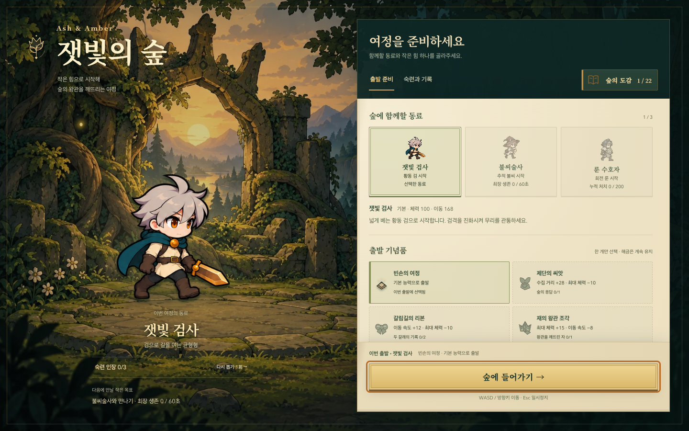
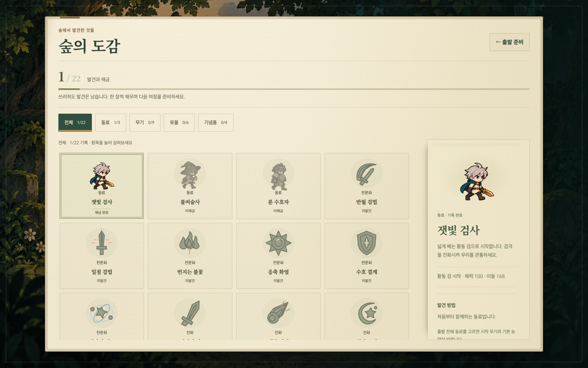
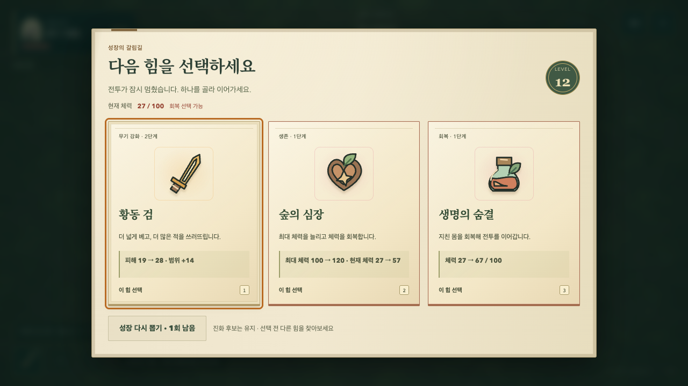
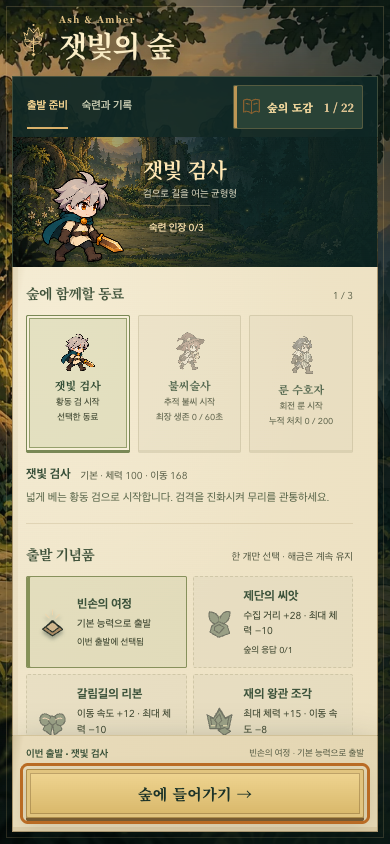

# 잿빛의 숲 — 일러스트 무대와 탐험 도감

2026-10-07. 반복되는 녹색 패널에서 벗어나, 로비부터 결과까지 하나의 게임으로 기억되는 시각 언어를 만들기 위한 개편이다. 기존 2D 카툰 캐릭터와 5분 전투·성장·수집 규칙은 유지한다.

## 선택한 방향

**황금빛 숲의 입구, 손때 묻은 탐험 도감, 황동 여행 도구.**

로비는 왼쪽의 세계와 동료, 오른쪽의 출발 준비로 나눈다. 배경의 부서진 왕관 아치가 최종 군주의 목표와 이어지고, 새 장표에는 같은 왕관과 씨앗을 결합한 문장을 사용한다. 제목은 자체 제공하는 한글 명조, 설명은 기존 고딕으로 나눈다. 단순히 모든 패널의 색을 바꾸는 대신 화면의 용도에 따라 재질과 구성을 바꾼다.

| 화면 | 적용한 경험 |
| --- | --- |
| 출발 준비 | 크게 보이는 동료와 숲, 종이 준비 영역, 고정 출발 요약과 버튼. 모바일에서도 작은 일러스트 무대를 유지한다. |
| 숙련과 기록 | 같은 도감 안의 별도 기록 면. 출발 버튼을 찾으러 돌아갈 필요가 없다. |
| 숲의 도감 | 표본 카드와 오른쪽 관찰 노트. 미발견 실루엣과 실제 수집 완료를 구분한다. 목록과 세부만 내부 스크롤한다. |
| 성장·유물 | 큰 수집품 그림, 잉크색 이름, 실제 능력 변화, 목표 표시, 단축키. 회복과 최대 체력은 물약/나무 심장으로 구분한다. |
| 보상 미리보기·저주 계약·일시정지 | 내용은 내부에서 읽고, 전투 복귀·계약 행동은 고정 하단에서 실행한다. 짧은 가로 화면도 동일하다. |
| 결과 | 선택한 동료가 있는 여정 엽서, 발견 보상과 다음 목표, 고정 재도전/동료 선택. |
| 전투 | 낮은 대비의 그린 바닥 그림, 황동 테두리 HUD, 실제 동료 초상, 기존 위험 예고와 피격 표시의 우선순위 유지. |
| 불러오기 | 실제 6개 전투 이미지의 완료 수를 표시. 실패 시 재시도로 복구하며 준비가 끝나기 전 출발을 허용하지 않는다. |

## 구현과 자산

- `folio.css`는 기존 기능 레이아웃 위의 시각 계층이다. 화면 상태는 overlay의 `data-screen`, panel의 `phase-*`로 명시한다.
- `ui-art.js`의 문장과 `collection-art.js`의 네 일반 성장 그림은 원본 SVG다. 기존 19개 수집품, 무기·전문화·진화 그림과 동일한 색과 외곽선 원칙을 사용한다.
- 새 숲 그림 335,312바이트와 바닥 239,638바이트는 생성 결과의 크기/구도를 유지한 WebP다. [프롬프트와 출처](../../../../public/art/survivor/SANCTUARY-PROMPT.md).
- 한글 제목 글꼴은 Noto Serif KR 700을 현재 UI 문자로 서브셋한 자체 WOFF2다. 외부 폰트 서비스 없이 제공하고 OFL을 함께 배포한다. [출처·라이선스·재생성](../../../../public/fonts/README.md).
- 바닥은 초기화 때 한 번 512px 캔버스에 캐시하고 패턴으로 그린다. 전투 상태, 난수, 적/입자 수, 저장 스키마를 변경하지 않는다.
- HUD의 장식 초상은 `data-portrait`를 사용한다. 출발 선택 버튼의 `data-character`와 충돌하지 않도록 분리한다.

## 완료 기준과 확인

완료 기준은 로비·도감·성장·유물·계약·정지·결과·HUD·로딩의 시각 통일, 고정 주요 행동, 문서 외부 스크롤 없음, 키보드/터치/모션 감소 동작, 기존 기록 보존, 실제 Pages 하위 경로의 자산/서체 제공이다. 시각 품질은 실제 렌더된 화면으로 판단하고, 자동 검사는 흐름과 회귀를 확인한다.

- 로컬 코어 **127개**, Chromium 브라우저 **120개** 통과. 실제 이미지 로딩 5/6에서 출발을 막고 완료 뒤 여는 검사, 740×360 재개/재굴림 초기 노출 검사를 추가했다.
- WebKit·Firefox 각각 **15개** 집중 UI 흐름 통과. Firefox는 글꼴을 정상 적용하지만 `FontFace.family`에 따옴표를 포함해 반환했다. 이름 직렬화를 정규화하고 실제 loaded 상태 검사를 유지한 뒤 해당 검사를 두 엔진에서 다시 통과했다.
- 1280×720/600, 1440×900, 390×844, 320×568, 740×360에서 로비·도감·고정 행동을 확인했다. 작은 가로 화면의 보상 복귀·정지 재개·저주 계약·재굴림은 독립 검증으로 추가 확인했다. 문서 외부 스크롤과 콘솔 오류는 없다.
- 낮은 화면에서 동료의 발과 설명이 겹친 문제를 동료 크기와 머리글 간격으로 수정했다. HUD 초상 식별자 충돌, 유물 맥락 설명의 옛 밝은색, 종이 위 작은 글씨/키보드 포커스 대비도 수정했다. 저체력 경고는 붉은색으로 구분한다.
- 새 ground 적용 후 세 화면의 12초 후반 군집 검사에서 프레임 간격 P95 **16.7–16.8ms**, 50ms 초과 프레임 0. 로컬 headless Chrome의 진단값이며 물리 모바일 성능 주장이 아니다.
- 새 디자인과 바닥을 사용한 **실제 시간 전체 플레이 3판**도 통과했다. 고정 시드 42의 자동 입력 진단에서 검사는 259.17초 승리, 불씨술사는 293.78초 승리, 룬 수호자는 300초 생존이었다. 세 판 모두 두 선택 이벤트·유물 2개·성장·결과 저장·새 판 초기화가 정상이며 콘솔 오류는 없었다. [전체 기록](./sanctuary-fullrun-2026-10-07.json). 입력 시점과 브라우저 실행 속도의 영향을 받는 진단이며 승률이나 사람의 재미를 의미하지 않는다.
- Pages 하위 경로 빌드와 production 시작·정지·도감·잠금·그림·한글 서체·QA 전역 제거 검사가 통과했다. 독립 최종 검수의 미해결 필수 수정은 없다.

아래는 실제 브라우저 캡처다. 로비/도감은 새 저장 기록이며, 성장 화면만 회복 선택을 확인하는 개발용 장면이다.

## 공개 전달

실행 커밋 `85949969f906c40d1ff0d1c8fcb594fbdf953399`를 main에 커밋·푸시했다. [전체 CI와 Pages 배포](https://github.com/Seung-Won-Yu/rune-drift-survivors/actions/runs/37570002052)가 성공했다. 코어 **127개**, 새 게임 브라우저 **120개**, 기존 3D 브라우저 **86개**, production 경로 검사까지 통과했다.

[공개 게임](https://seung-won-yu.github.io/rune-drift-survivors/survivor/)의 JS·CSS·숲 배경·바닥·WOFF2가 로컬 Pages 빌드와 바이트 단위로 일치했다. 1280×720, 390×844, 740×360에서 새 배경과 실제 서체 로딩, 도감 22개, 미발견 실루엣 19개, 목표 저장과 재로드, 고정 출발, 새 판 무기 상태, 시작/정지를 확인했다. 문서 가로/세로 overflow는 0, 콘솔·HTTP 오류는 없고 개발 전용 QA 전역도 없다. Codex 인앱 브라우저에서도 기존 공개 저장 기록을 유지한 채 새 로비가 표시되는 것을 확인했다.

| 공개 파일 | 바이트 | SHA-256 |
| --- | ---: | --- |
| survivor-CKNn_TP6.js | 137101 | `3e1c81a8bb3535812fdec9389b05e5c29436710e00e6a9e1b0816778421ed3c2` |
| survivor-u0OmfAbn.css | 84582 | `0b43f63319c77d4a45428a3b3b9bb771c54f671d9f21bfdad9f45039f55e2916` |
| forest-sanctuary-v2.webp | 335312 | `c6068228b52b871c6cda05de8827bef52dd1b2197d6bc45cb9f1d76ff833e38b` |
| forest-ground-v1.webp | 239638 | `80b515243c24a317257d04fdbfa764da32f0c475a65be2d18e9b6a159a622b9a` |
| ash-journal-700.woff2 | 76888 | `8589f94878172c3ac317809cc01bc763d17e425a06a6393820c5cb50d7bed02c` |

[구조화된 최종 검증 기록](./sanctuary-verification-2026-10-07.json). 그림·서체·화면·실행 상태를 함께 확인했으며 이번 개편에 미완료 필수 작업은 없다. 최종 검증 기록과 최신 전투 캡처는 실행 코드를 바꾸지 않는 문서 커밋으로 남긴다. `[skip ci]`는 위 실행 커밋의 전체 검사와 실제 공개 파일 대조를 대신하지 않는다.

## 품질의 범위

이번 작업은 전체 UI와 환경 표현을 다시 설계한 구현이다. 캐릭터의 기존 네 포즈를 새 프레임 애니메이션으로 교체한 것은 아니다. 테스트 장면의 보스·후반 군집은 가독성과 부하를 보기 위한 개발용 상태이며 실제 플레이로 얻은 기록으로 표시하지 않는다. 사람의 재미, 장기 재방문율, 물리 모바일 기기의 성능 향상을 자동 테스트 결과로 주장하지 않는다.
