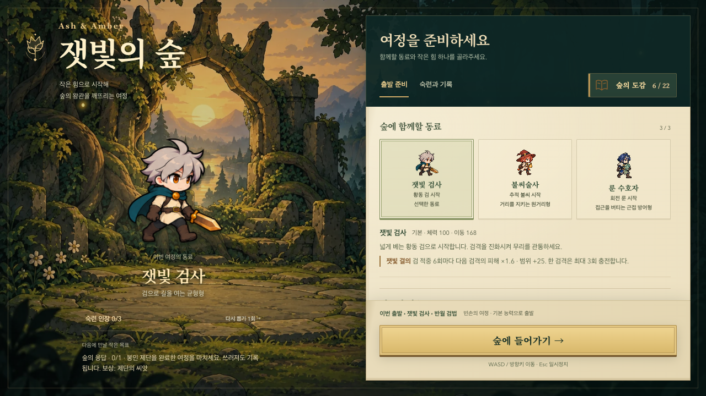
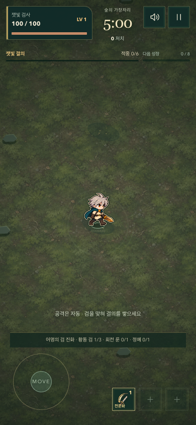

# 행동이 만드는 동료의 개성

목표: 같은 무기를 모아도 동료마다 움직이는 이유가 다르고, 발견한 전투법이 다음 출발의 선택으로 이어지는 5분 여정.

## 이번 개발 범위

- [x] 검사: 실제 검 적중으로 결의를 쌓아 다음 검격 강화. 빈 공격·검기·무적 대상은 충전하지 않는다.
- [x] 불씨술사: 실제 이동 거리로 불씨를 준비. 다음 발사의 첫 탄만 강화하며 정지·메뉴 대기로 충전하지 않는다.
- [x] 수호자: 실제 회전 룬 적중으로 한시적 보호막. 완전 흡수는 피격·반격·회복으로 기록하지 않는다.
- [x] 전승: 발견한 주무기 전문화 하나를 선택해 1단계부터 시작. 자유로운 출발 유지, 동료별 저장, 미발견·다른 무기 선택 방지. 기존 실험 목표와 구분한다.
- [x] 60/120/180초 정예를 서로 다른 피하기 패턴으로 구성. 처치 뒤 짧은 추가 적 감소와 주변 경험치 회수로 보상을 체감한다. 살아 있는 적과 경고는 유지한다.
- [x] 로비 설명·전승 카드·전투 HUD·발동 표현·결과 기록을 실제 규칙과 연결한다. 화면 전체 스크롤 없이 키보드·터치·작은 화면에서 조작할 수 있어야 한다.
- [x] 저장 호환, 중복 적용 방지, 일시정지, 피해/보호막, 경고-판정 일치, 개체 상한을 검증한다.
- [x] 캐릭터/전문화/난이도 경로 시뮬레이션 및 실제 시간 브라우저 플레이를 실행하고 실패도 기록한다.
- [ ] README/개발 문서, main 커밋/푸시, Pages 배포와 공개 화면을 확인한다.

## 플레이 기준

추가 버튼 없이 이동·거리·무리 배치로 능력의 발동을 유도한다. HUD는 숫자뿐 아니라 무엇을 하면 준비되는지 알려준다. 수집 보상은 영구 수치 노가다 대신 서로 다른 공격 범위·속도·위험의 선택을 앞당긴다. 기본 출발도 승리할 수 있어야 한다.

정예는 진화 조건을 충족시키는 상대이자 1분 단위의 긴장과 해소다. 4분 군주와 5분 제한은 유지한다. 신규 시스템이 쏟아져도 피해 경고와 플레이어 위치를 가리지 않는다.

자동 테스트로 재미나 재방문을 입증했다고 주장하지 않는다. 관찰 가능한 전투 차이, 실제 발동 빈도, 성장 시점, 완주/패배 분포와 UI 조작성으로 구현을 평가하고 사람의 플레이 피드백을 남은 검증으로 구분한다.

## 검증 중 발견한 문제

첫 실제 시간 검사에서 불씨술사의 시드 42 번지는 불꽃 경로가 3분대에 패배했다. 같은 정상 규칙 시뮬레이션은 199.2초, 포자 피해 69로 재현되었다. 세 포자 중심 간격 100은 반경 44와 플레이어 판정 반경 12를 포함하면 사이를 통과할 여유가 없다. 안내에 맞는 실제 간격을 확보한 뒤 같은 시드와 경로로 다시 검증한다. 실패 결과는 `rhythm-first-pass.json` 진단에 보존한다.

포자 중심 간격을 140으로 늘려 실제 플레이어가 통과할 공간을 확보했다. 별도로 자동 입력이 경험치를 쫓아 활성 포자에 재진입하던 문제를 확인했다. 입력 드라이버는 0.2초 반응 지연을 유지하면서 화면의 포자와 적을 기준으로 짧은 회피 방향을 고른다. HP·피해·무기·시간 규칙이나 검사 기준을 완화하지 않았다. 따라서 이전/이후 자동 승리 횟수는 엄밀한 동일 입력 A/B 비교로 해석하지 않는다.

## 구현 규칙

- 고유 능력의 준비/발동/보호막은 런 상태다. 모든 선택 메뉴와 일시정지에서 시간이 멈추고 재시작에는 초기화된다.
- 전승은 `inheritances`에 동료별로 저장하며 발견·동료 해금·주무기 일치를 재검증한다. 1개 갈래 rank만 1로 적용한다. 이전 v1 저장은 발견과 기록을 보존하고 전승은 선택하지 않은 상태로 마이그레이션된다.
- 정예는 60/120/180초부터 순서대로 등장한다. 이전 정예와 처치 보상 창이 끝날 때까지 다음 정예는 대기한다. 240초 군주 등장은 대기와 무관하게 유지된다. 경고와 피해 판정은 동일한 돌진/포자 규칙을 사용한다.
- 정예 처치 시 260 거리 안의 경험치만 회수하며 살아 있는 적과 포자는 사라지지 않는다. 회수한 경험치는 실제 접근 후 획득해 정상 레벨업 순서를 따른다.
- 고유 능력 HUD는 체력/경험치와 함께 유지된다. 발동 문구·검격 굵기·불씨 크기·수호 윤곽을 구분하며 적 경고선과 캐릭터가 가장 위에 보이는 순서를 지킨다.

## 로컬 검증 결과

- 코어 136개 통과. 기존 브라우저 전체 123개 통과 후 추가된 목표/전승 충돌을 포함한 4개 흐름도 별도로 통과했다. 최종 CI 대상은 124개다.
- 수정한 정예 경고·터치 HUD·전승의 집중 검사 11개 통과. WebKit 11개, Firefox 11개도 통과했다.
- 정상 규칙 150경로: 기본 21/30, 목표 21/30, 숙련 20/30, 짙은 안개 21/30, 전승 21/30 군주 격파. 모든 동료/모드에서 승리 경로가 있고 숙련 인장 3개를 획득할 수 있다. 전승은 전투법을 앞당기는 선택이며 승리 보장이나 모든 갈래의 무조건적인 상위 호환으로 설계하지 않았다.
- 실제 시간 시드 42 검사: 검사 281.18초 승리(고유 능력 72회), 불씨술사 270.87초 승리, 수호자 300초 생존(보호막 약 128 피해 흡수). 모두 정예 3종·선택 사건 2개·유물 2개, 정확히 한 번 저장, 새 판 초기화를 검증했다. 오류 0개.
- [검증 데이터](./rhythm-verification-2026-10-07.json)에 실패 경로와 최종 결과를 함께 보존한다. 자동 검사 환경의 프레임 시간은 실제 휴대폰 성능 보장이 아니다.

위 화면은 전승 선택을 검증하기 위해 발견 기록을 넣은 독립 브라우저를 촬영했다.

## 직접 플레이할 때 확인할 것

1. 검사로 무리를 베고, 결의를 모은 뒤 강한 검격이 나가는 순간을 설명 없이 알아볼 수 있는가.
2. 불씨술사로 이동/정지를 바꾸면서 강화 불씨의 준비 차이를 느끼는가. 위험한 경험치를 쫓는 것과 빈 공간을 잡는 것 중 선택이 생기는가.
3. 수호자는 룬이 닿는 거리를 유지하면서 보호막이 생기고 사라지는 것을 읽을 수 있는가.
4. 발견한 전투법을 전승해 첫 30초가 달라지는지, 반대 갈래를 발견하려 자유로운 출발을 선택하는 이유가 있는가.
5. 정예의 공격을 보고 피했는데 맞는 느낌이 없는지, 처치 후 경험치와 잠깐의 여유가 보상으로 느껴지는가.

사람의 재미·난이도 체감·재방문과 실제 저사양 휴대폰 성능은 별도 플레이 피드백으로 확인한다. 현재 개발을 모든 콘텐츠와 모든 기기의 최종 완성이라고 부르지 않는다.
