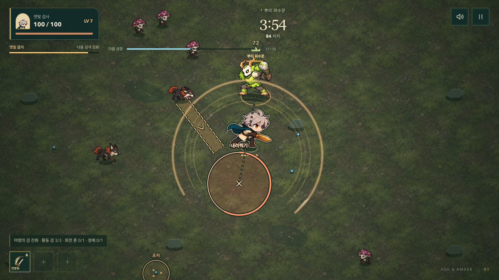

# 몸으로 읽히는 전투 — 첫 동작 개선

2026-10-08. 전투 중 캐릭터와 몬스터의 움직임을 더 발전시키라는 요청에 따라 잿빛 검사·숲 사냥개·숲거인부터 실제 포즈를 교체했다. 숲·황동·2D 카툰 방향, 로비의 한 화면/내부 스크롤 구조는 유지한다.

## 적용

- 검사: 보행 8, 공격 6, 피격 4, 쓰러짐 4포즈. 기존 한 그림의 확대·회전보다 몸통·팔다리·망토의 실제 자세 변화가 중심이다.
- 사냥개: 보행 8, 공격 8, 피격 4, 처치 4포즈. 웅크림→도약→착지→재정비가 실제 돌진 단계와 맞는다.
- 숲거인: 보행 8, 공격 8, 피격 4, 처치 4포즈. 곤봉 들기→머리 위 준비→내려찍기→회복이 분리된다. 뿌리 파수꾼도 자신의 공격 시간으로 이 포즈를 사용한다.
- 검 적중 `.18초`, 일반/챔피언 돌진과 내려찍기 시계, 피해·충돌·난수·보상은 유지했다. 새 보행 시계는 실제 이동 거리에서 계산하므로 감속·일시정지에 맞는다.
- 포즈마다 원본의 실제 경계를 측정했다. 몸의 크기를 일정하게 유지하고 발 기준점을 맞추며, 공중 도약은 의도한 높이를 남긴다. 기존 추가 찌그러뜨림은 새 그림에 중복 적용하지 않는다.
- 사냥개·거인의 잔상은 0.42초 동안 실제 무너지는 자세를 보여 준다. 처치·경험치 지급 시점과 잔상 개수 제한은 그대로다.
- 출발 전에 모든 사용 포즈와 밝은 피격 그림을 캐시에 준비한다. 전투 중 첫 피격/처치에 캔버스를 새로 만들지 않는다. 위험 경고와 플레이어 전면 표시 순서는 유지한다.
- 동작 줄이기에서는 보행과 추가 이동을 멈추고 준비/공격/피격을 정적인 상태로 구분한다.

새 WebP 세 장은 약 1.25MiB다. 기본 제공 imagegen으로 제작했고, 알파와 원본 크기를 보존하여 WebP로 인코딩했다. [정확한 프롬프트와 선택 근거](../../../public/art/survivor/MOTION-PROMPTS.md).

생성된 검사 12·13번 프레임에는 서로 겹치는 영역과 칼 누락이 있어 게임에서 제외했다. 수정 생성본도 다른 프레임에 결함이 있어 채택하지 않았다. 따라서 검사 공격을 8포즈라고 표시하지 않는다.

## 확인 방법

개발 서버에서 [`/docs/design/survivor-restart/motion-lab/`](./motion-lab/index.html)를 열면 실제 게임과 같은 그림·포즈 선택기로 보행/공격/피격/처치를 비교할 수 있다. 재생·정지·좌우·동작 줄이기 조작을 제공한다. 이 페이지는 개발용 문서이며 Pages의 게임 번들에는 포함하지 않는다.

- `actor-animation.js`: 피해 시점 전후, 피격/사망 우선순위, 실제 이동과 감속·정지, 제외 포즈, 사망 포즈 종료를 검사한다.
- 브라우저: 이미지 9장 로드, 발 접지, 좌우 반전, 도약/쓰러짐 실루엣, 전투 중 캐시 할당 없음, 화면별 플레이어/경고 가림 방지를 검사한다.
- 실제 시간 65.217초 진단 플레이: 84처치, 레벨 7, 고유 능력 9회 발동, 실행 오류 0. 시간·체력·피해를 바꾸지 않는 기존 QA 조작기로 진행했다. 60초 파수꾼 등장으로 세 배우를 같은 전투에서 확인했다.
- 해당 65초 데스크톱 실행의 프레임 간격 p95는 16.7ms, 50ms 초과는 1회였다. 다른 QA와 동시에 실행했으며 이 수치를 휴대폰 성능이나 사람의 승률로 해석하지 않는다. 이 측정 후 최초 포즈 캐시를 출발 전 준비하도록 옮겼다.

[공격 동작 비교 캡처](./images/motion-attack-lab.png). 전투 캡처는 일반 규칙 QA 조작기, 비교 캡처는 개발용 동작 랩이다.

## 로컬 최종 검사

- 단위 검사 141개 통과.
- 최초 전체 브라우저 검사 127개 중 125개 통과. 로딩 검사는 이전 6장 기준을 기대하던 테스트를 9장으로 갱신하고, 새 세 아틀라스 각각의 다운로드 지연도 추가했다. 실행 중 코드 갱신과 겹친 상자 보상 검사도 수정 완료 상태에서 다시 실행했다.
- 변경/실패 범위를 포함한 15개 브라우저 검사 재실행 전부 통과. 현재 총 130개 시나리오를 검증했다. 재실행은 새 포즈 디코딩·발 접지·좌우·사망, 전투 중 캔버스 추가 할당 0, 플레이어/경고 우선순위, 이미지 4종 지연, 상자 18초 보상, 검 동작·일시정지·모션 감소를 포함한다.
- 캐시 준비 변경 후 1280×720, 390×844, 740×360의 밀집 전투 각 12초 검사에서 p95 16.7ms, 50ms 초과 0회.
- Pages 빌드와 production smoke 통과. 새 WebP 세 장 로드, QA API 제거, 도감·시작·일시정지, 폰트와 경로 정상.
- IAB에서 새 보행/처치 포즈와 실제 게임의 크기·가독성을 확인했다. 모바일 경고 캔버스도 직접 검토했다.

공개 배포 검증은 배포 완료 후 기록한다.

## 다음 범위

이번 변경은 세 배우의 전투 동작 개선이다. 불씨술사·룬 수호자·버섯·군주의 포즈 확장, 상하 방향별 그림, 무기별 전용 공격과 보스 전환 연출은 남아 있다. 모든 UI/UX나 게임의 완성도가 확정됐다는 의미가 아니다. 실제 플레이에서 경고 읽기와 타격의 무게를 평가한 뒤 같은 기준을 확장한다.
