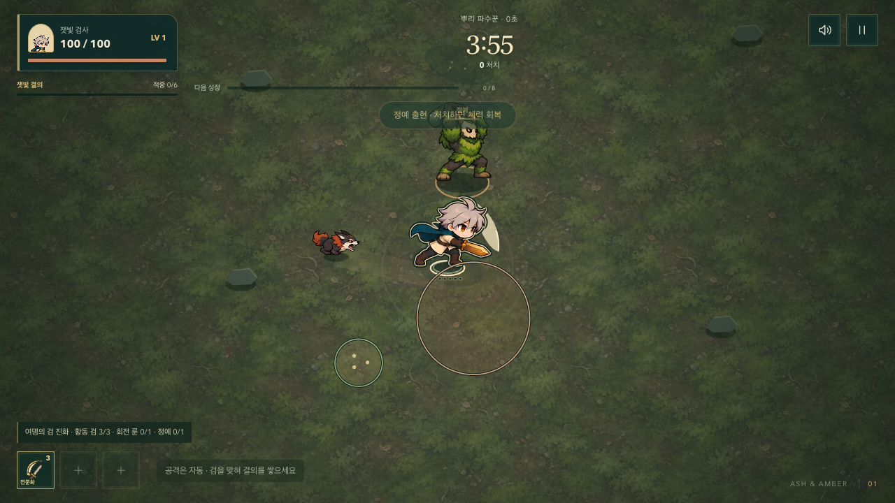
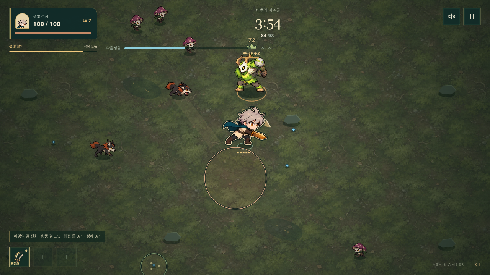
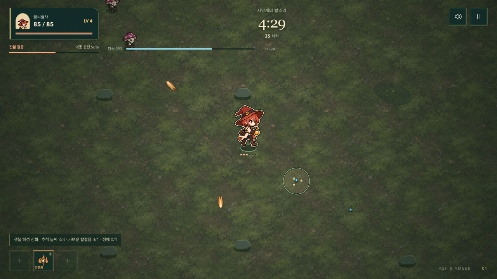

# 표시보다 액션이 먼저 보이도록

2026-10-08. 사용자가 65초 전투 캡처에서 큰 범위 표시가 동작과 어긋나 보인다고 지적했다. “저렇게까지는 하지 않아도 되고 액션과 투사체가 잘 표현되면 좋겠다”는 방향을 적용했다.

## 수정한 표현

- 검을 휘두르기 전 사거리 호를 없앴다. 넓은 검법의 동심 보조 호·큰 외곽 광택·추가 리본도 제거했다. 실제 검 적중 순간에만 손과 칼 가까이 짧은 베기 획이 생긴다. 일점 검법은 짧은 찌르기로 구분한다.
- 불씨 투사체는 진행 방향을 향한 밝은 머리·끝이 가늘어지는 불꽃 꼬리·배경과 분리되는 어두운 외곽을 사용한다. 강화탄은 형태와 크기가 다르다. 여명의 검기는 큰 정지 호처럼 보이지 않도록 얇은 날과 짧은 뒤꼬리로 바꿨다.
- 불씨 폭발은 동그란 범위 테두리 대신 불꽃 파열과 밝은 중심으로 바꿨다. 달빛/가시 파동의 중복 점선 원도 제거했다.
- 내려찍기의 적→표적 점선, X, 문구, 추가 진행 호를 없앴다. 실제 잠긴 위험 영역의 얇은 경계 하나와 약한 바닥색만 남긴다. 실제 타격 순간에는 시전자 발밑부터 표적까지 짧은 지면 균열과 파편이 연결된다. 피해보다 늦게 날아가는 가짜 투사체는 추가하지 않았다.
- 사냥개는 경로 테두리·점선·화살표 대신 웅크림과 약한 바닥 예고를 사용한다. 돌진 시 전체 경로가 사라지고 실제 사냥개 뒤에 짧은 속도 흔적이 붙는다. 포자 역시 이름·중복 원을 없애고 얇은 영역과 포자만 남긴다.
- 보스의 큰 공격 예고, 적중 판정·사거리·회피 시간·피해·성장 구조는 유지했다. 플레이어 반경 12에 따른 몸 겹침 판정을 이유로 위험 영역을 더 키우지 않는다.

[모바일 투사체 비교](./images/action-projectiles-390.png). 두 캡처는 실제 렌더러를 쓰는 개발용 정지 장면이며, 플레이 기록이나 해금 성과를 나타내지 않는다.

## 실제 진행 장면

아래는 개발용 입력 드라이버가 일반 이동·제시된 업그레이드 선택만 수행한 실시간 진단이다. 피해·성장 수치나 생존을 강제로 바꾸지 않았다. 플레이어의 주관적 재미 검증을 대신하지 않는다.

- 검사 65.17초: 84처치, 레벨 7, 체력 100, 능력 9회 발동, 브라우저 오류 0.
- 불씨술사 30.15초: 35처치, 레벨 4, 체력 85, 능력 9회 발동, 브라우저 오류 0.
- 두 실행의 프레임 간격 p95 16.7ms, 50ms 초과는 각각 1프레임이었다. 앞서 기록한 12초 밀집 장면의 50ms 초과 0과 구분한다.

## 검증

- 전체 단위 검사 145개 통과. 새 검격의 크기 제한, 투사체의 실제 위치/속도 방향, 경고 중복 표시 제거, 돌진 흔적의 현재 위치 추종, 타격 순간 지면 균열의 출발점/도착점, 상태·난수 불변을 확인했다.
- 변경 범위 브라우저 검사 22개 통과. 전투 렌더 불변, 검격이 거대한 범위 도형으로 돌아가지 않는 픽셀 검사, 위험 영역/보스 경계의 가림 방지, 실제 회피·적중 타이밍, 동작 감소, 무기 진화, 세 화면의 밀집 전투를 포함한다. 전체 브라우저 묶음은 131개다.
- 밀집 전투 12초×3화면: p95 16.7–16.8ms, 50ms 초과 0. 데스크톱 자동 브라우저 수치이며 물리 휴대폰 성능을 의미하지 않는다.
- IAB 실제 렌더와 PC/모바일 캡처를 직접 검토했다. Pages용 빌드와 production smoke가 통과했다. 출발·일시정지·도감·자산 경로 및 개발용 QA API가 프로덕션에 없는지 확인했다.
- 기존 ‘모든 경고 경계’ 검사는 의도적으로 삭제한 사냥개 레일을 더 이상 요구하지 않는다. 대신 준비 중의 바닥 예고와 실제 돌진 위치의 잔상, 기존 회피/적중 검사를 유지한다. 광역/보스 경계 가림 검사는 그대로 통과해야 한다.

## 전체 CI에서 발견한 보완점

첫 전체 CI는 단위 검사 145개와 브라우저 130개가 통과했지만, 진화 공격의 픽셀 구분 검사 1개가 실패했다. 불씨 폭발을 간결하게 바꾸면서 기본/잿불 혜성 진화의 모양이 같아진 실제 표현 회귀였다. 검사를 완화하지 않고 진화한 탄두에 뾰족한 밝은 중심과 갈라진 속꼬리를, 폭발 중심에 작은 빛의 파열을 넣었다. 큰 범위 문양은 복원하지 않았다. 같은 검사에 비행 중인 기본/진화 탄두 비교도 추가했다.

수정 후 표현 단위 17개와 관련 브라우저 6개가 통과했다. 이어 수정 커밋 `a03d00a`의 전체 CI에서도 단위 145개, 브라우저 131개, Pages 실행 검사가 통과했다.

## 배포 확인

- 커밋 `6188999`에서 전투 표시를 정리하고, `a03d00a`에서 진화 불씨의 구분을 보완했다.
- [GitHub Actions 37712090887](https://github.com/Seung-Won-Yu/rune-drift-survivors/actions/runs/37712090887): 단위 145개, Survivor 브라우저 131개, Pages 실행 검사, 기존 게임 브라우저 87개 통과 후 Pages 배포 성공.
- 공개 게임의 `survivor-BqbUb7G2.js`는 로컬 Pages 빌드와 SHA-256 `8f1cfda3c142191f28dd8430e41a41f4982f29ed1fd09325eecd2fd2873619a0`이 일치했다. 세 동작 WebP도 로컬 파일과 해시가 같았다.
- 공개 주소에서 시작·일시정지·도감 22항목·진화 조합·잠긴 전승·필수 이미지 로딩 검증이 통과했고, 실행 오류와 요청 실패는 0이었다. 개발용 QA API는 없었다.
- 열려 있던 IAB 공개 로비를 갱신해 최신 JS가 적용됐으며 기존 동료 선택과 수집 진행이 유지되는 것을 확인했다.
- 검증 시각: 2026-10-08 10:41 KST. 기록용 후속 커밋은 문서만 바꾸며 실행 코드는 변경하지 않는다.
